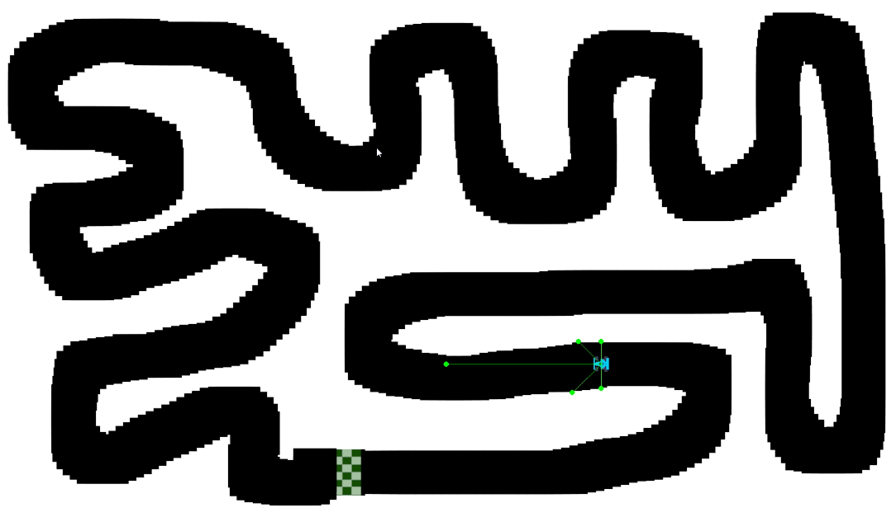

# GRLL
##### General Reinforcement Learning Library

| **Algorithm** | **Discrete Action Space** | **Continuous Action Space** | 
| ------------- | ------------------------- | --------------------------- |
| A2C | :heavy_check_mark: | :heavy_check_mark: |
| REINFORCE | :heavy_check_mark: | :heavy_check_mark: |
| DQN | :heavy_check_mark: | :x: |
| ADQN | :heavy_check_mark: | :x: |

## Install

## Usage

아래는 OpenAI의 gym으로 테스트한 예제이다.

```python
import torch.optim as optim
from GRL.PG.models import ANN_V2
from GRL.PG import A2C
import gym

env = gym.make('CartPole-v0')

num_actions = env.action_space.n
num_states = env.observation_space.shape[0]
A2C_model = ANN_V2(num_states, num_actions)

optimizer = optim.Adam(A2C_model.parameters(), lr=1e-4)

advantage_AC = A2C(
    env=env,
    model=A2C_model,
    optimizer=optimizer,
)

advantage_AC.train(trainTimesteps=1000000)
```

만약 다른 알고리즘을 사용하고 싶다면 다음과 같이 작성하면 된다.<br/>
```python
from GRL.PG import REINFORCE
"""
또는
from GRL.VB import DQN
from GRL.VB import ADQN
"""
```

## Custom Environment

만약 pygame 모듈을 다운로드 했다면 다음 두 가지 환경을 사용할 수 있다.

### RacingEnv

<br/>
*RacingEnv-v0*

RacingEnv_v0: 8개의 센서 길이값을 state로 받고, 오른쪽, 왼쪽, 가운데의 3개의 행동을 가진다.<br/>
RacingEnv_v2: stacked grayscale image를 state로 받고, 오른쪽, 왼쪽, 가운데의 3개의 행동을 가진다.<br/>
RacingEnv_v3: 자동차 주변의 이미지를 stacked graysacle하게 만든 다음, 이를 state로 받고, 오른쪽, 왼쪽, 가운데의 3개의 행동을 가진다.<br/>
RacingEnv_v4: 자동차 주변의 이미지를 stacked graysacle하게 만든 다음, 이를 state로 받고, 액셀과 방향을 순서대로 list로 받는 6개의 행동을 가진다.<br/>
예들들어, [0, 1]을 행동으로 주면, 엑샐은 밟지 않고, 방향은 가운데를 유지한다.

### MazeEnv

<br/>
*MazeEnv-v1*

MazeEnv_v0: 맵 전체의 벡터 정보를 state로 받고, 동서남북으로 움직이는 4개의 행동을 가진다.<br/>
