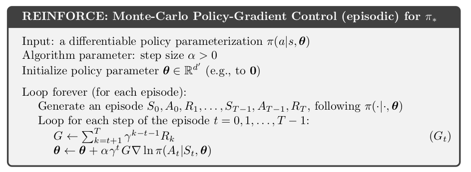
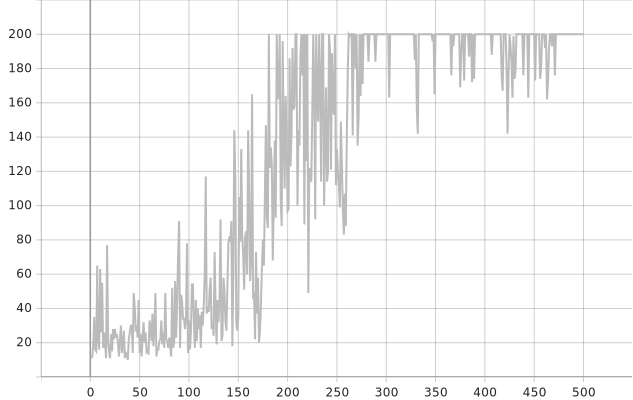
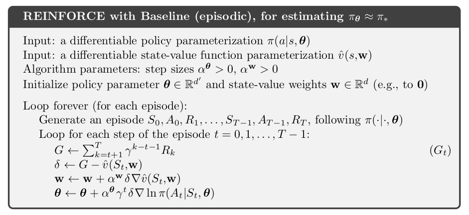
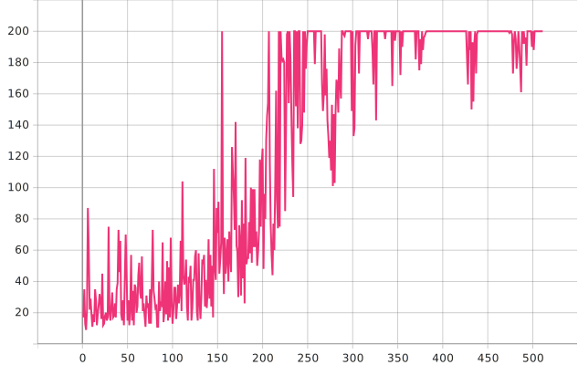
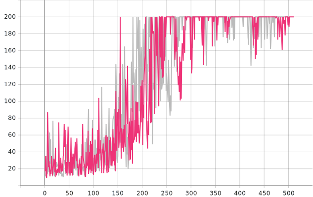
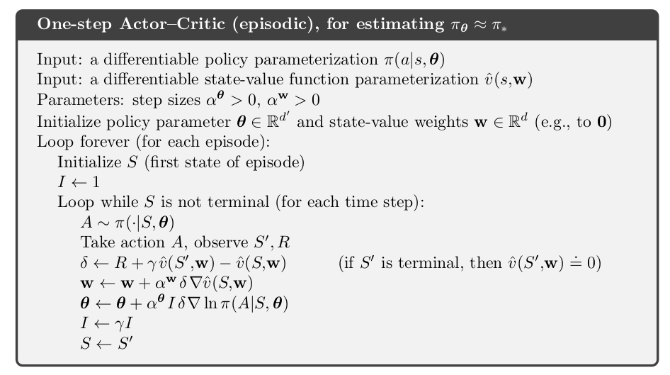
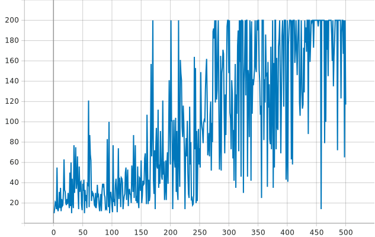
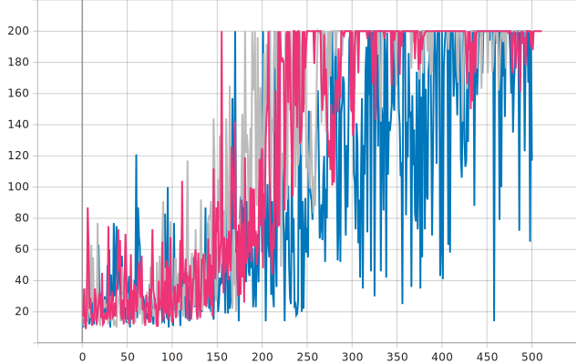
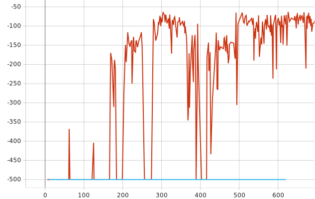

---
# 6월 4주차
##### 정재현
---

> 마지막을 제외한 모든 테스트는 gym CartPole-v0에서 진행되었습니다.

## 1. REINFORCE와 REINFORCE with baseline class 구현

코드

```python

import numpy as np
import random 
import matplotlib.pyplot as plt
from collections import namedtuple, deque

# PyTorch
import torch
import torch.nn as nn
import torch.nn.functional as F
import torchvision.transforms as T
import torch.optim as optim
from torch.autograd import Variable


Transition = namedtuple('Transition',
                       ('state', 'action', 'next_state', 'reward'))

class ReplayMemory(object):

    def __init__(self, capacity):
        self.memory = deque([],maxlen=capacity)

    def push(self, *args):
        """Save a transition"""
        self.memory.append(Transition(*args))

    def sample(self, batch_size):
        return random.sample(self.memory, batch_size)

    def __len__(self):
        return len(self.memory)

class REINFORCE():

    '''
    params_dict = {
        'device': device to use, 'cuda' or 'cpu'
        'env': environment like gym
        'model': torch models for policy and value funciton
        'optimizer': torch optimizer
        #MAX_EPISODES = maximum episodes you want to learn
        'maxTimesteps': maximum timesteps agent take 
        'discount_rate': GAMMA # step-size for updating Q value
        'epsilon': epsilon for epsilon greedy action
    }
    '''

    def __init__(self, **params_dict):
        super(REINFORCE, self).__init__()

        # init parameters 
        self.device = params_dict['device']
        self.env = params_dict['env']
        self.model = params_dict['model']
        self.optimizer = params_dict['optimizer']
        self.maxTimesteps = params_dict['maxTimesteps'] 
        self.discount_rate = params_dict['discount_rate']
        self.epsilon = params_dict['epsilon']
        self.useBaseline = params_dict['epsilon']

        
        # torch.log makes nan(not a number) error, so we have to add some small number in log function
        self.ups=1e-7

    # In Reinforcement learning, pi means the function from state space to action probability distribution
    # Returns probability of taken action a from state s
    def pi(self, s, a):
        s = torch.Tensor(s).to(self.device)
        _, probs = self.model.forward(s)
        probs = torch.squeeze(probs, 0)
        return probs[a]
    
    # Returns the action from state s by using multinomial distribution
    def get_action(self, s, epsilon = 0): # epsilon 0 for greedy action
        with torch.no_grad():
            s = torch.tensor(s).to(self.device)
            _, probs = self.model.forward(s)
            probs = torch.squeeze(probs, 0)

            if random.random() >= epsilon:
                a = probs.multinomial(num_samples=1)
            else:
                a = torch.rand(probs.shape).multinomial(num_samples=1)

            a = a.data
            action = a[0]

            return action
  
    # Returns a value of the state (state value function in Reinforcement learning)
    def value(self, s):
        s = torch.tensor(s).to(self.device)
        value, _ = self.model.forward(s)
        value = torch.squeeze(value, 0)

        return value    

    # Update weights by using Actor Critic Method
    def update_weight(self, Transitions, entropy_term = 0):
        Qval = 0
        loss = 0
        lenLoss = Transitions.memory.__len__()

        # update by using mini-batch Gradient Ascent
        for Transition in reversed(Transitions.memory):
            s_t = Transition.state
            a_t = Transition.action
            s_tt = Transition.next_state
            r_tt = Transition.reward

            Qval = r_tt + self.discount_rate * Qval

            # get actor loss
            log_prob = torch.log(self.pi(s_t, a_t) + self.ups)
            advantage = Variable(Qval - self.value(s_t) * self.useBaseline)
            actor_loss = -(advantage * log_prob)

            # get critic loss
            value = self.value(s_t)
            next_value = self.value(s_tt)
            critic_loss = 1/2 * (Qval - value).pow(2)

            loss += actor_loss + critic_loss + 0.001 * entropy_term
        
        loss = loss/lenLoss
        
        self.optimizer.zero_grad()
        loss.backward()
        self.optimizer.step()

    def train(self, maxEpisodes, testPer=10, isRender=False, useTensorboard=False, tensorboardTag="REINFORCE"):
        try:
            returns = []
            
            #<<<<<<<<<<<<<<<<<<<<<<<<<<<<<<<<<<<<<<<<<<<<<<<<<<<<<<<<<<<<<<<<<
            # TENSORBOARD
            
            if useTensorboard:
                from torch.utils.tensorboard import SummaryWriter
                writer = SummaryWriter()

            #>>>>>>>>>>>>>>>>>>>>>>>>>>>>>>>>>>>>>>>>>>>>>>>>>>>>>>>>>>>>>>>>>

            for i_episode in range(maxEpisodes):
                
                Transitions = ReplayMemory(maxEpisodes)
                state = self.env.reset()
                done = False
                
                #==========================================================================
                # MAKE TRAIN DATA
                #==========================================================================

                # while not done:
                for timesteps in range(self.maxTimesteps):

                    if isRender:
                        env.render()

                    action = self.get_action(state, epsilon=self.epsilon)
                    next_state, reward, done, _ = self.env.step(action.tolist())
                    Transitions.push(state, action, next_state, reward)
                    state = next_state

                    if done or timesteps == self.maxTimesteps-1:
                        break
                # train
                self.update_weight(Transitions)

                #==========================================================================
                # TEST
                #==========================================================================

                if (i_episode+1) % testPer == 0: 
                    state = self.env.reset()
                    done = False
                    rewards = []

                    for timesteps in range(self.maxTimesteps):
                        if isRender:
                            env.render()

                        action = self.get_action(state)
                        next_state, reward, done, _ = self.env.step(action.tolist())

                        rewards.append(reward)
                        state = next_state

                        if done or timesteps == self.maxTimesteps-1:
                            break

                    returns.append(sum(rewards))

                    #<<<<<<<<<<<<<<<<<<<<<<<<<<<<<<<<<<<<<<<<<<<<<<<<<<<<<<<<<<<<<<<<<
                    # TENSORBOARD

                    if useTensorboard:
                        writer.add_scalars("Returns", {tensorboardTag: returns[-1]}, i_episode+1)

                    #>>>>>>>>>>>>>>>>>>>>>>>>>>>>>>>>>>>>>>>>>>>>>>>>>>>>>>>>>>>>>>>>>
                    
                    print("Episode: {0:<10} return: {1:<10}".format(i_episode + 1, returns[-1]))

        except KeyboardInterrupt:
            print("==============================================")
            print("KEYBOARD INTERRUPTION!!=======================")
            print("==============================================")

            plt.plot(range(len(returns)), returns)
        finally:
            plt.plot(range(len(returns)), returns)

        self.env.close()

if __name__ == "__main__":

    from models import ANN_V1 # import model
    import gym # Environment 

    MAX_EPISODES = 10000
    MAX_TIMESTEPS = 1000

    ALPHA = 0.1e-3 # learning rate
    GAMMA = 0.99 # discount_rate
    epsilon = 0 # for epsilon greedy action

    # device to use
    device = torch.device('cuda' if torch.cuda.is_available() else 'cpu')

    # set environment
    env = gym.make("CartPole-v0")
    #env = gym.make("Acrobot-v1")
    #env = gym.make("MountainCar-v0")

    num_actions = env.action_space.n
    num_states = env.observation_space.shape[0]

    ACmodel = ANN_V1(num_states, num_actions).to(device)
    optimizer = optim.Adam(ACmodel.parameters(), lr=ALPHA)

    REINFORCE_parameters = {
        'device': device, # device to use, 'cuda' or 'cpu'
        'env': env, # environment like gym
        'model': ACmodel, # torch models for policy and value funciton
        'optimizer': optimizer, # torch optimizer
        'maxTimesteps': MAX_TIMESTEPS, # maximum timesteps agent take 
        'discount_rate': GAMMA, # step-size for updating Q value
        'epsilon': epsilon, # epsilon greedy action for training
        'useBaseline': True # use value function as baseline or not
    }

    # Initialize REINFORCE Mehtod
    RF = REINFORCE(**REINFORCE_parameters)

    # TRAIN Agent
    RF.train(MAX_EPISODES, isRender=False, useTensorboard=True, tensorboardTag="CartPole-v1")

```

### 1) REINFORCE

<br/>
*출처: Richard Sutton and Andrew Barto. Reinforcement Learning: An Introduction. MIT Press, 2018*

<br/>
*baseline없이 학습을 진행한 경우*

### 2) REINFORCE with baseline

<br/>
*출처: Richard Sutton and Andrew Barto. Reinforcement Learning: An Introduction. MIT Press, 2018*

<br/>
*baseline으로 Value Funciton을 사용한 경우*

### 3) 위 두 방법 비교

<br/>
*위 두 그래프의 비교*

이론적으로는 baseline이 없는 방법이 Variance가 더 커야하지만 그 차이가 보이지 않는다.

## 2. ActorCritic class 구현

코드

```python

import numpy as np
import random 
import matplotlib.pyplot as plt
from collections import namedtuple, deque

# PyTorch
import torch
import torch.nn as nn
import torch.nn.functional as F
import torchvision.transforms as T
import torch.optim as optim
from torch.autograd import Variable


Transition = namedtuple('Transition',
                       ('state', 'action', 'next_state', 'reward'))

class ReplayMemory(object):

    def __init__(self, capacity):
        self.memory = deque([],maxlen=capacity)

    def push(self, *args):
        """Save a transition"""
        self.memory.append(Transition(*args))

    def sample(self, batch_size):
        return random.sample(self.memory, batch_size)

    def __len__(self):
        return len(self.memory)

class ActorCritic():

    '''
    params_dict = {
        'device': device to use, 'cuda' or 'cpu'
        'env': environment like gym
        'model': torch models for policy and value funciton
        'optimizer': torch optimizer
        #MAX_EPISODES = maximum episodes you want to learn
        'maxTimesteps': maximum timesteps agent take 
        'discount_rate': GAMMA # step-size for updating Q value
        'epsilon': epsilon for epsilon greedy action
    }
    '''

    def __init__(self, **params_dict):
        super(ActorCritic, self).__init__()

        # init parameters 
        self.device = params_dict['device']
        self.env = params_dict['env']
        self.model = params_dict['model']
        self.optimizer = params_dict['optimizer']
        self.maxTimesteps = params_dict['maxTimesteps'] 
        self.discount_rate = params_dict['discount_rate']
        self.epsilon = params_dict['epsilon']
        self.useBaseline = params_dict['epsilon']

        
        # torch.log makes nan(not a number) error, so we have to add some small number in log function
        self.ups=1e-7

    # In Reinforcement learning, pi means the function from state space to action probability distribution
    # Returns probability of taken action a from state s
    def pi(self, s, a):
        s = torch.Tensor(s).to(self.device)
        _, probs = self.model.forward(s)
        probs = torch.squeeze(probs, 0)
        return probs[a]
    
    # Returns the action from state s by using multinomial distribution
    def get_action(self, s, epsilon = 0): # epsilon 0 for greedy action
        with torch.no_grad():
            s = torch.tensor(s).to(self.device)
            _, probs = self.model.forward(s)
            probs = torch.squeeze(probs, 0)

            if random.random() >= epsilon:
                a = probs.multinomial(num_samples=1)
            else:
                a = torch.rand(probs.shape).multinomial(num_samples=1)

            a = a.data
            action = a[0]

            return action
  
    # Returns a value of the state (state value function in Reinforcement learning)
    def value(self, s):
        s = torch.tensor(s).to(self.device)
        value, _ = self.model.forward(s)
        value = torch.squeeze(value, 0)

        return value    

    # Update weights by using Actor Critic Method
    def update_weight(self, Transition, entropy_term = 0):
        s_t = Transition.state
        a_t = Transition.action
        s_tt = Transition.next_state
        r_tt = Transition.reward

        # get actor loss
        log_prob = torch.log(self.pi(s_t, a_t) + self.ups)
        advantage = Variable(r_tt + self.value(s_tt) - self.value(s_t))
        actor_loss = -(advantage * log_prob)

        # get critic loss
        critic_loss = 1/2 * (r_tt + self.value(s_tt) - self.value(s_t)).pow(2)

        loss = actor_loss + critic_loss + 0.001 * entropy_term
    
        self.optimizer.zero_grad()
        loss.backward()
        self.optimizer.step()

    def train(self, maxEpisodes, testPer=10, isRender=False, useTensorboard=False, tensorboardTag="ActorCritic"):
        try:
            returns = []
            
            #<<<<<<<<<<<<<<<<<<<<<<<<<<<<<<<<<<<<<<<<<<<<<<<<<<<<<<<<<<<<<<<<<
            # TENSORBOARD
            
            if useTensorboard:
                from torch.utils.tensorboard import SummaryWriter
                writer = SummaryWriter()

            #>>>>>>>>>>>>>>>>>>>>>>>>>>>>>>>>>>>>>>>>>>>>>>>>>>>>>>>>>>>>>>>>>

            for i_episode in range(maxEpisodes):
                
                state = self.env.reset()
                done = False
                
                #==========================================================================
                # MAKE TRAIN DATA
                #==========================================================================

                # while not done:
                for timesteps in range(self.maxTimesteps):

                    if isRender:
                        env.render()

                    action = self.get_action(state, epsilon=self.epsilon)
                    next_state, reward, done, _ = self.env.step(action.tolist())

                    # trans means transition 
                    trans = Transition(state, action, next_state, reward)

                    state = next_state

                    if done or timesteps == self.maxTimesteps-1:
                        break

                    # train
                    self.update_weight(trans)

                #==========================================================================
                # TEST
                #==========================================================================

                if (i_episode+1) % testPer == 0: 
                    state = self.env.reset()
                    done = False
                    rewards = []

                    for timesteps in range(self.maxTimesteps):
                        if isRender:
                            env.render()

                        action = self.get_action(state)
                        next_state, reward, done, _ = self.env.step(action.tolist())

                        rewards.append(reward)
                        state = next_state

                        if done or timesteps == self.maxTimesteps-1:
                            break

                    returns.append(sum(rewards))

                    #<<<<<<<<<<<<<<<<<<<<<<<<<<<<<<<<<<<<<<<<<<<<<<<<<<<<<<<<<<<<<<<<<
                    # TENSORBOARD

                    if useTensorboard:
                        writer.add_scalars("Returns", {tensorboardTag: returns[-1]}, i_episode+1)

                    #>>>>>>>>>>>>>>>>>>>>>>>>>>>>>>>>>>>>>>>>>>>>>>>>>>>>>>>>>>>>>>>>>

                    print("Episode: {0:<10} return: {1:<10}".format(i_episode + 1, returns[-1]))

        except KeyboardInterrupt:
            print("==============================================")
            print("KEYBOARD INTERRUPTION!!=======================")
            print("==============================================")

            plt.plot(range(len(returns)), returns)
        finally:
            plt.plot(range(len(returns)), returns)

        self.env.close()

if __name__ == "__main__":

    from models import ANN_V1 # import model
    import gym # Environment 

    MAX_EPISODES = 10000
    MAX_TIMESTEPS = 1000

    ALPHA = 0.1e-3 # learning rate
    GAMMA = 0.99 # discount_rate
    epsilon = 0 # for epsilon greedy action

    # device to use
    device = torch.device('cuda' if torch.cuda.is_available() else 'cpu')

    # set environment
    env = gym.make("CartPole-v0")
    #env = gym.make("Acrobot-v1")
    #env = gym.make("MountainCar-v0")

    num_actions = env.action_space.n
    num_states = env.observation_space.shape[0]

    ACmodel = ANN_V1(num_states, num_actions).to(device)
    optimizer = optim.Adam(ACmodel.parameters(), lr=ALPHA)

    ActorCritic_parameters = {
        'device': device, # device to use, 'cuda' or 'cpu'
        'env': env, # environment like gym
        'model': ACmodel, # torch models for policy and value funciton
        'optimizer': optimizer, # torch optimizer
        'maxTimesteps': MAX_TIMESTEPS, # maximum timesteps agent take 
        'discount_rate': GAMMA, # step-size for updating Q value
        'epsilon': epsilon, # epsilon greedy action for training
        'useBaseline': True # use value function as baseline or not
    }

    # Initialize ActorCritic Mehtod
    AC = ActorCritic(**ActorCritic_parameters)

    # TRAIN Agent
    AC.train(MAX_EPISODES, isRender=False, useTensorboard=True, tensorboardTag="CartPole-v1")
```

<br/>
*출처: Richard Sutton and Andrew Barto. Reinforcement Learning: An Introduction. MIT Press, 2018*

<br/>
*ActorCritic 방법으로 학습한 경우*


<br/>
*REINFORCE를 포함한 모든 그래프*

## 3. 만든 모듈의 간단한 사용법

```python
import sys
sys.path.append("../") # to import module

# PyTorch
import torch
import torch.optim as optim

# import model
from ActorCritic.models import ANN_V2
from REINFORCE.REINFORCE import REINFORCE

# Environment 
import gym

# device to use
device = torch.device('cuda' if torch.cuda.is_available() else 'cpu')

# set environment
env = gym.make('CartPole-v0')

# set parameters
num_actions = env.action_space.n
num_states = env.observation_space.shape[0]
REINFORCE_model = ANN_V2(num_states, num_actions).to(device)
optimizer = optim.Adam(REINFORCE_model.parameters(), lr=3e-4)

REINFORCE_parameters= {
    'device': device, # device to use, 'cuda' or 'cpu'
    'env': env, # environment like gym
    'model': REINFORCE_model, # torch models for policy and value funciton
    'optimizer': optimizer, # torch optimizer
    'maxTimesteps': 1000, # maximum timesteps agent take 
    'discount_rate': 0.99, # step-size for updating Q value
    'epsilon': 0.7, # 1.0 means total random policy
    'useBaseline': False
}

# Initialize Actor-Critic Mehtod
RF = REINFORCE(**REINFORCE_parameters)

# TRAIN Agent
RF.train(maxEpisodes=500, testPer=1, useTensorboard=True, tensorboardTag="REINFORCE_noBASELINE_"+gym_name)

```

## 4. 발견된 문제점

### 1) 학습보다 데이터를 얻는데 시간이 너무 많이 소요된다.

이건 해결해야할 과제이다.

임시적인 대안으로 화면에 송출하지 않고 메모리상에서만 환경이 존재하도록 할 수 있다.

### 2) 에피소드가 끝날 때 까지 실행할 수 없는 task는 terminal이 없는 테스크와 다를바 없다.

#### 이는 one-step ActorCritic을 사용하여 해결했다.


*Acrobot REINFORCE(파란색), one-step ActorCritic(빨간색) 비교*

Acrobot은 terminal에 가기 전에 500번 째 step에서 자동 종료된다. 즉, 에피소드가 끝나지 않는다.
하지만 one-step ActorCritic은 이런 상황에 대처 가능하다.

> *Richard Sutton and Andrew Barto. Reinforcement Learning: An Introduction. MIT Press, 2018*의 124페이지에 다음과 같은 문장이 있다.<br/>
> **Some applications have very long episodes, so that delaying all learning unitl the end of the episode is too slow**

