---
# 7월 1주차
##### 정재현
---

## 1. Q-learning과 DQN(Deep Q-learning

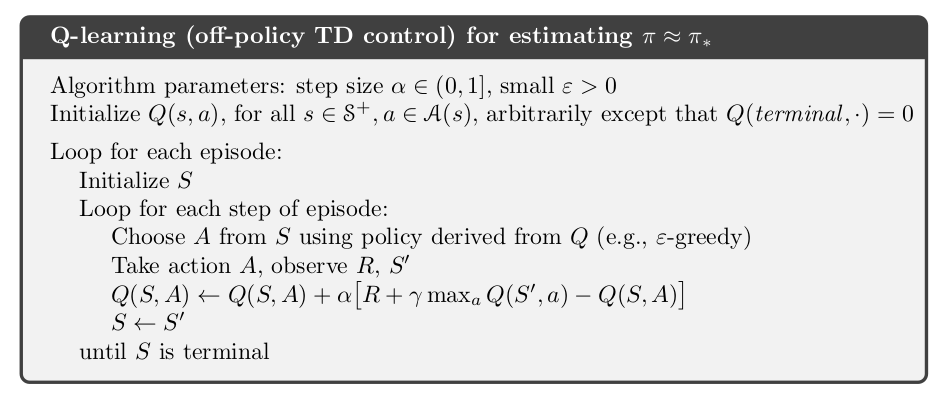 
*Richard Sutton and Andrew Barto. Reinforcement Learning: An Introduction. MIT Press, 2018. page 131*

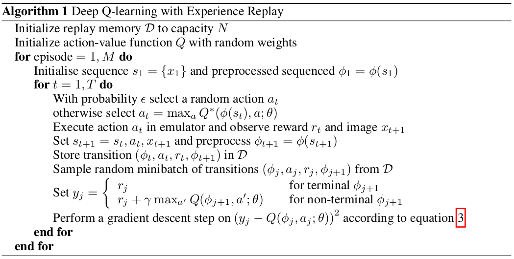 
*Mnih, V., Kavukcuoglu, K., Silver, D., Graves, A., Antonoglou, I., Wierstra, D., and Riedmiller, M. (Dec 2013). Playing Atari with deep reinforcement learning. Technical Report arXiv:1312.5602 [cs.LG], Deepmind Technologies. 5*

### 1) CartPole-v0 Test

#### ActorCritic
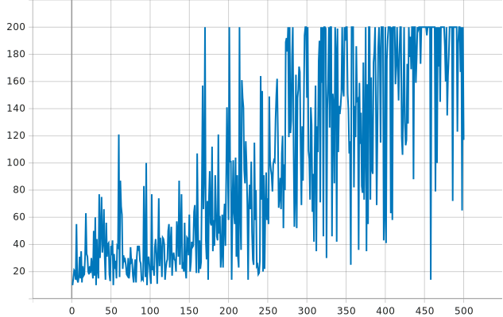

#### REINFORCE with baseline
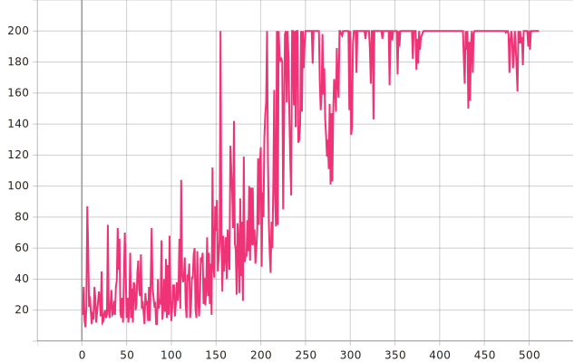

#### DQN
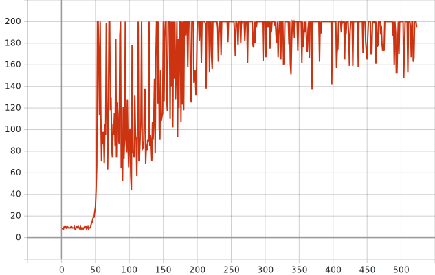

Variance 통제가 안된다.

### 2) Acrobot-v1 Test

#### REINFORCE with baseline, ActorCritic
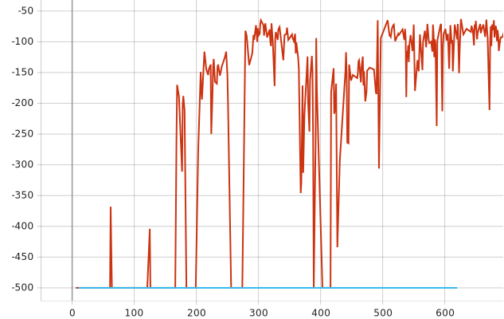

#### DQN
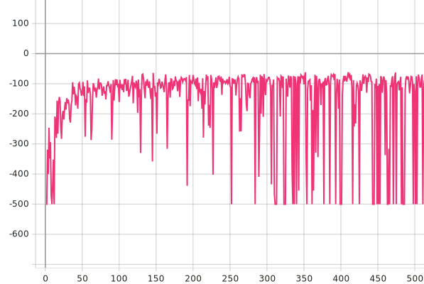

똑같이 분산 통제가 안된다.

## 2. DQN의 문제점은 Overestimation과 Approximation Errors

### 1) Overestimation(오른쪽)과 Approximation Error(왼쪽)를 보여주는 그래프
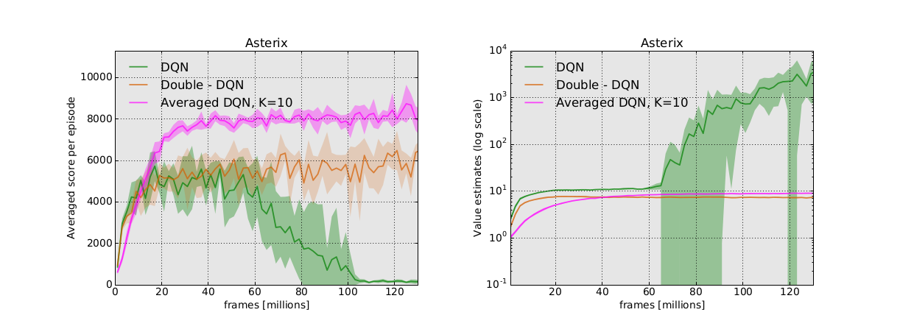 
*Oron Anschel, Nir Baram, and Nahum Shimkin. (Mar 2017). Averaged-DQN: Variance Reduction and Stabilization for Deep Reinforcement Learning. arXiv:1611.01929v4 [cs.AI]. page 4*

### 2) Overestimation
Q learning에 나오는 max opration은 estimated value를 true value보다 크게 만든다.

### 3) Approximation Error
오른쪽으로 가면서 엡실론이 점점 작아지고, Policy는 greedy하게 변한다. 
따라서 학습이 진행됨에 따라 Exploring을 보장하지 않는 상태에서 greedy action만을 취하게 된다. 

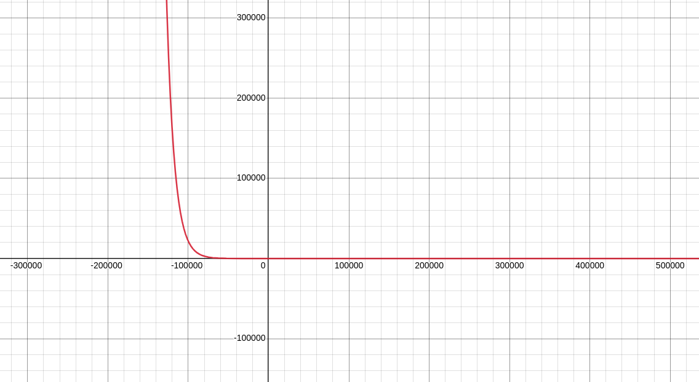
*Acrobot-v1에서 사용한 엡실론 스케쥴링*

---

#### 실제 랜덤 행동을 선택할 확률

step 1 - 99.0%  
step 10 - 99.8%  
step 100 - 98.0%  
step 1000 - 89.6%  
step 10000 - 36.4%  
step 20000 - 13.4%

---

## 3. 해결방법

### 1) Optimal Value를 찾을 때 까지 Exploring을 보장

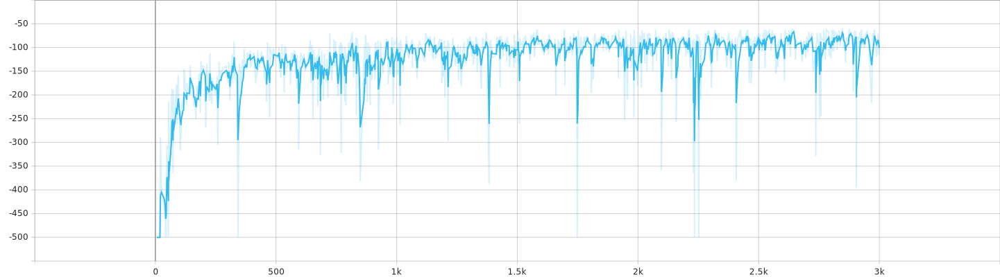 
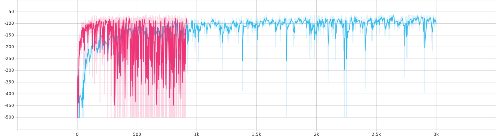 
*Acrobot-v0, 파란선은 빨간선의 10배 만큼의 decay를 가진다.*

### 2) Averaged DQN

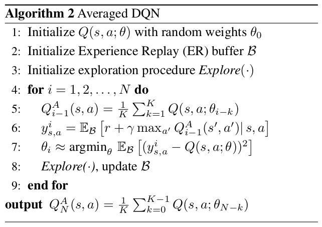 
*Oron Anschel, Nir Baram, and Nahum Shimkin. (Mar 2017). Averaged-DQN: Variance Reduction and Stabilization for Deep Reinforcement Learning. arXiv:1611.01929v4 [cs.AI]. page 3*

#### 논문에 의하면 과거 K개의 모델을 확인할 경우 이론적으로 1/K배 이하의 분산 줄어듬을 확인할 수 있다.

#### 하지만, 이는 행동 선택을 위해 K번의 forward pass를 필요로 한다.

 
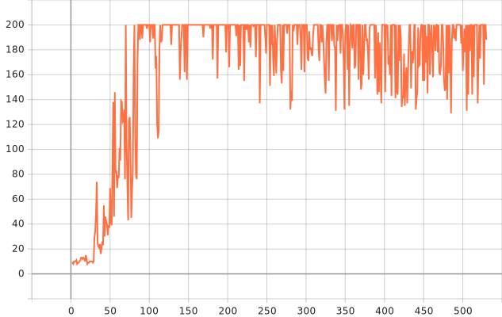 
*CartPole-v0에 Averaged DQN을 사용하여 얻은 결과*

### 3) Double DQN

#### 아직 Double DQN을 공부하지 않았다. 하지만 Double Q learning은 max연산으로 인한 positive bias를 줄이기 위해 제안되었다.

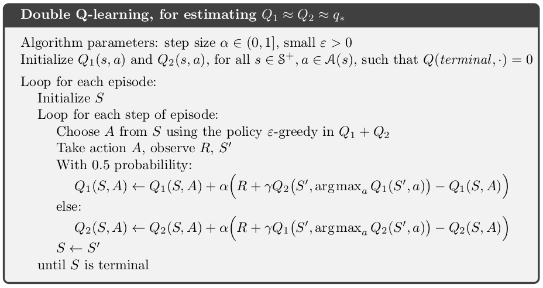 
*Richard Sutton and Andrew Barto. Reinforcement Learning: An Introduction. MIT Press, 2018. page 136*

위같이 Double DQN 또한 positive bias를 줄이는데 좋은 역할을 할 것이다. 따라서 Double DQN 클래스 개발 또한 계획하고 있다.

## 4. 의문점들

### 1) Episodic Task임에도 불구하고 Timestep에 한계를 두는 경우가 존재한다. 이 때, 마지막 상태는 터미널 상태인가? 

### 2) Policy Improvement는 항상 정답인가?

#### Policy Improvement란 현제의 Value function을 기반으로 Policy를 greedy하게 만들어주는 과정을 의미한다.

#### 하지만 DQN연구에서 다음과 같은 현상을 목격했다.

#### 아래 그래프는 Acrobot에 DQN과 ADQN을 적용시켰을 때 나오는 결과이다.
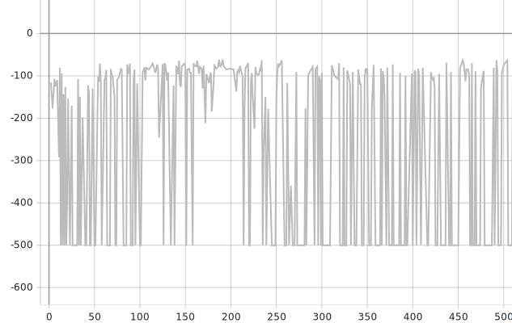 
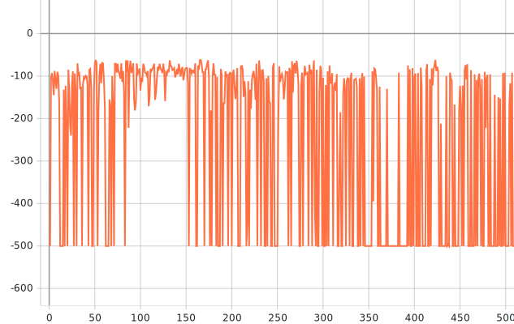 

#### 하지만 ADQN과 Policy를 Epsilon Greedy로 하면?
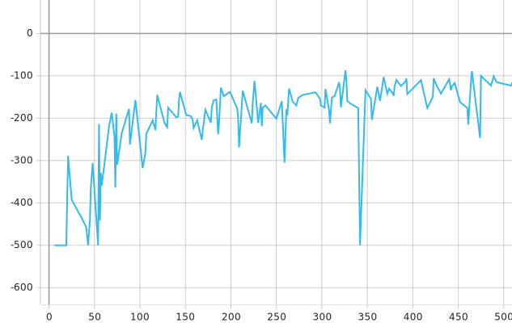 

#### 그리고 다음은 ADQN과 DQN에 stochastic action selection을 적용했을 때의 그래프이다.
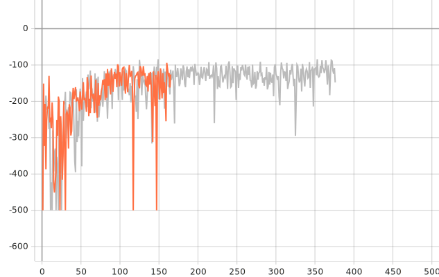 

## 5. 다음주 계획

### 1. 시간이 비교 가능하도록 코드 수정

#### 학습 시간을 비교하는 코드가 아직 없다. 따라서 이를 비교하는 코드를 작성하고자 한다.

### 2. Return 뿐 아니라, 다른 metric 찾고 적용

#### 지금은 Return으로만 성능을 측정하고 있으나 averaged Q value와 같은 좋은 metric 또한 존재한다.

### 3. 마더 클래스 작성 및 코드 리펙토링

#### Policy Gradient 기반 방법과 DQN 기반 방법을 융합할 마더 클래스를 고려하고 코드를 작성하고자 한다.

---

## 6. 이후 공부 및 개발 방향

### 3. 테스트를 위한 환경 코드 작성

#### 지금까지는 너무 국한된 환경에서 학습 진행, 따라서 결과를 일반화 할 수 있는 환경 개발

### 4. 멀테 에이전트 대응 고려

#### 연구 시간 대비 테스트 시간이 너무 짦음, 효율적으로 연구를 진행하기 위해 멀티 에이전트에 대응 가능한 모둘 개발

환경이 늘어나면, 하이퍼파라미터 튜닝에 많은 시간을 소요할 것으로 예상된다. 따라서 멀티 에이전트에 대응하는 모듈 개발은 필수적이다.

방법은 두가지를 고려하고 있다.

1. 하나의 에이전트를 실행하는 프로그램을 병렬적으로 실행하여 비동기적으로 데이터를 수집한다.
2. 한개 이상의 에이전트를 실행할 수 있는 환경을 작성해여 환경의 상태와 행동을 벡터 단위로 주고받는다.

### 5. 모듈 개발과 병행하여 Inverse Reinforcement Learning 공부

#### 자연환경에서 정확한 보상을 찾기란 쉽지않다. IRL은 주어진 Optimal behavior로부터 보상함수를 찾는 방법이다.

