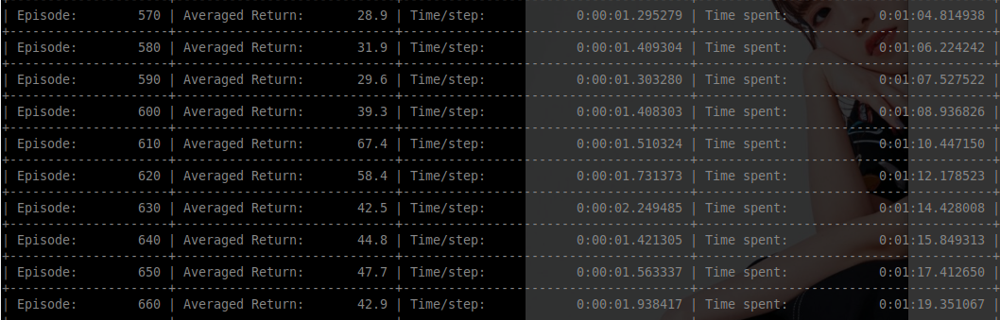
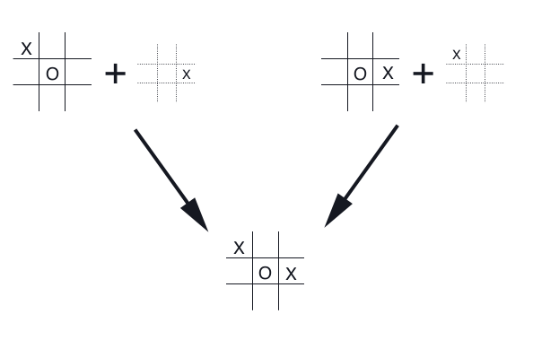

---
# 7월 1주차
##### 정재현
---

## 1. 사용이 간단하게 코드 수정

### 1) 예시 (onestep ActorCritic)

```python
# 만들어진 모듈과 기본으로 제공하는 뉴럴넷 모델을 임포트
from module.ActorCritic.models import ANN_V2
from module.ActorCritic import onestep_ActorCritic

# Optimizer를 결정하기 위해 임포트
import torch.optim as optim

# 환경
import gym
env = gym.make('CartPole-v0')

# 뉴럴넷을 생성
num_actions = env.action_space.n
num_states = env.observation_space.shape[0]
ActorCritic_model = ANN_V2(num_states, num_actions)

# Optimizer를 생성
optimizer = optim.Adam(ActorCritic_model.parameters(), lr=0.1e-3)

# 강화학습 클래스 초기화
AC = onestep_ActorCritic(
    env = env,
    model = ActorCritic_model,
    optimizer = optimizer
)

# 학습진행
AC.train(maxEpisodes = 500)
```

## 2. 각 스텝별 걸린 시간과 총 시간을 확인 가능하도록 코드 수정

<br/>

## 3. pickle을 사용하여 클래스 세이브, 로드가 가능하도록 메소드 작성

```python
    def save(self, saveDir: str = str(datetime)+".obj"):

        import pickle

        file = open(saveDir, 'wb')
        file.write(pickle.dumps(self.__dict__))
        file.close()

    def load(self, loadDir):

        import pickle

        file = open(loadDir, 'rb')
        dataPickle = file.read()
        file.close()

        self.__dict__ = pickle.loads(dataPickle)
```

### 로드를 사용한 예시코드
```python
import sys
sys.path.append("../") # to import module

# 만들어진 모듈과 기본으로 제공하는 뉴럴넷 모델을 임포트
from module.ActorCritic.models import ANN_V2
from module.ActorCritic import onestep_ActorCritic

# Optimizer를 결정하기 위해 임포트
import torch.optim as optim

# 환경
import gym
env = gym.make('CartPole-v0')

# 뉴럴넷을 생성
num_actions = env.action_space.n
num_states = env.observation_space.shape[0]
ActorCritic_model = ANN_V2(num_states, num_actions)

# Optimizer를 생성
optimizer = optim.Adam(ActorCritic_model.parameters(), lr=0.1e-3)

# 강화학습 클래스 초기화
AC = onestep_ActorCritic(
    env = env,
    model = ActorCritic_model,
    optimizer = optimizer
)

# 불러오기
AC.load("./saved_models/test.obj")

# 테스트
AC.isRender['test'] = True # 환경을 출력하도록 변경
AC.test(testSize=10)
```

## 4. 마더 클래스 작성

### 모델이 두 개 필요한 ActorCritic과 한 개만 필요한 Value Based Method를 분리

1. RL
    1. Actor Critic
        1. REINFORCE
        2. onestep-ActorCritic
    2. Value Based
        1. DQN
        2. ADQN

## 문제점!!

### 1) Discrete Action Space에만 대응하는 모듈, 아직 Continuous Action Space를 지원하지 않는다.

### 2) Afterstate 기반 선택의 문제는 해결하지 못한다.

#### 바둑, tictactoe, 그리고 오목과 같은 행동이 곧 상태가 되는 환경에 대해서는 작동하지 못한다.

<br/>
*Richard Sutton and Andrew Barto. Reinforcement Learning: An Introduction. MIT Press, 2018. page 137*

> 위의 왼쪽과 오른쪽은 Action Value Function 기반의 선택을 하면 완전히 다른 경우이다. 하지만 다음 상태를 보면 똑같다. 즉, 같은 가치를 가지는 행동을 다르게 측정하는 것이다. 따라서 이러한 문제를 해결하기 위해서는 다음상태(Afterstate) 기반의 선택을 해야한다.

