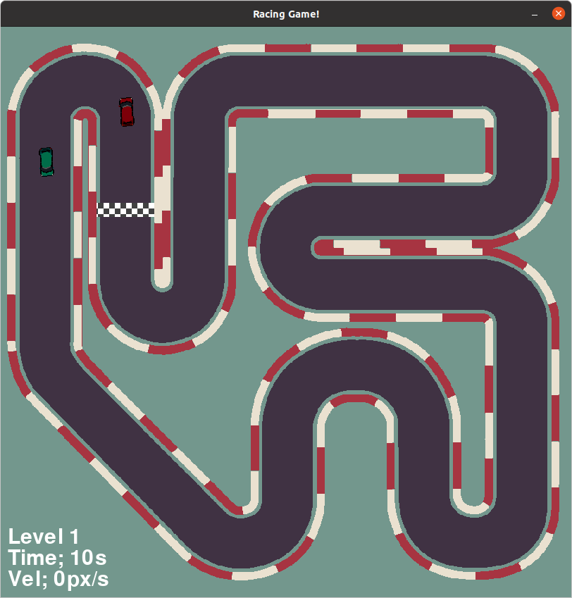
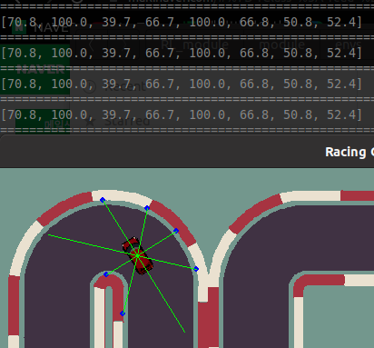
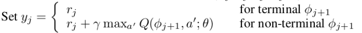
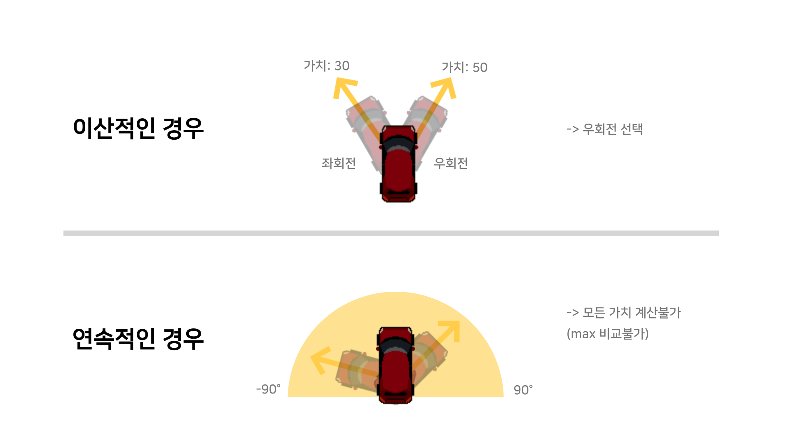
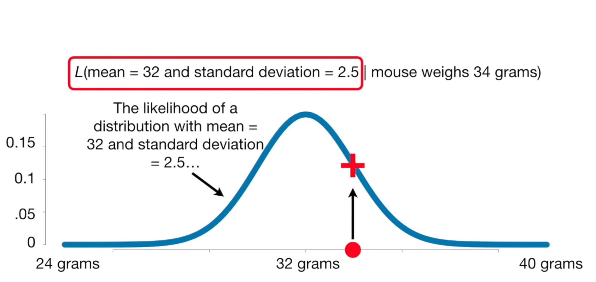

---
# 7월 3주차
##### 정재현
##### 이아영 (게임 이미지 작업)
---

# 1. Continuous Action Space에 대응 가능한 강화학습 테스트를 위해, 환경으로 사용할 자동차 게임 구현

저번 주, 자료에서 Continuous Action Space에 대응되지 않는 문제점을 언급했다. 하지만 복수의 행동을 가지면서 연속적인 값을 받는 환경이 OpenAI gym classic에 존재하지 않는다.
따라서 직접 만들었다.

**행동 선택에 있어서 궁극적인 목표는, 연속적이거나 이산적인 복수개의 행동을 동시에 강화학습 모듈이 처리할 수 있게 만드는 것이다.**

 
#### Author: Tech With Tim 
- [Pygame Car Racing Tutorial #1 - Moving The Car](https://www.youtube.com/watch?v=L3ktUWfAMPg&ab_channel=TechWithTim)
- [Pygame Car Racing Tutorial #2 - Pixel Perfect Collision](https://www.youtube.com/watch?v=WfqXcyF0_b0&ab_channel=TechWithTim)
- [Pygame Car Racing Tutorial #3 - Computer Car And Path Following](https://www.youtube.com/watch?v=V_B5ZCli-rA&ab_channel=TechWithTim)
- [Pygame Car Racing Tutorial #4 - Levels, Main Menu and Finishing Touches](https://www.youtube.com/watch?v=agnVylvZ038&ab_channel=TechWithTim)

**한 자동차는 플레이어이고, 나머지 자동차는 적이다. 벽에 부딪치면 게임은 리셋된다.** 
**그리고 레벨이 올라감에 따라 적 자동차의 속도가 빨라진다.**

# 2. 자동차 게임에 거리측정 센서 코드 작성

 

**위에 출력되고 있는 숫자가 거리를 측정한 배열이다.** 
**총 8개의 센서를 사용하며, 100은 센서의 최대 길이이다.**

# 3. 행동 선택 방식 변경에 있어서의 문제점들

**이는 코드 작성 뿐 아니라, 이론적으로 강화학습 알고리즘의 수렴성을 보장할 수 없음을 의미한다.**

## 3.1 Value Based Method(e.g. DQN)는 max와 argmax 연산 때문에, Continuous Action Space를 처리할 수 없다.

DQN에는 다음과 같은 의사코드가 존재한다.
 

그리고 여기서 max는 다음과 같은 의미를 가진다. 
**현재 가지고 있는 Action Value에서 최댓값을 고르겠다.**

> ### ex1) 
> 자동차와 에이전트를 생각해보자. 자동차는 항상 엑셀을 밟는 상태이며, 선택 가능한 행동은 좌회전과 우회전이라 가정하겠다.
> 센서값을 통해 얻어진 Action Value를 우회전, 좌회전 각각 [30, 50]라 하면, 위 수식의 max 연산을 통해 나오는 값은 50이 된다. 
> 이제, 가능한 행동이 연속적이라 생각해보자. 즉, 차가 바라본 방향 기준으로 -90도 부터 90도 사이라고 하자. 그러면 위 예시와 같은 벡터값은 얻을 수 없다. 
>  

**따라서 DQN은 불가능하고 argmax 연산도 비슷한 이유로 불가능하다. 이는 ADQN, DDQN 또한 바로 적용이 불가능함을 의미한다.**

## 3.2 Greedy, Epsilon-Greedy Policy는 불가능하다.

**위의 자동차 에이전트 상황(ex1)을 가정하여 Greedy, Epsilon-Greedy Policy를 설명하면 다음과 같다.**

#### Greedy Policy
1. 센서 값을 받는다.
2. 센서 값을 Action Value 함수에 넣어서 [30, 50]와 같은 Action Value를 얻는다.
3. Action Value가 큰 우회전을 선택한다.

#### Epsilon-Greedy Policy
1. 센서 값을 받는다.
2. 0 이상 1 이하의 무작위 실수를 E라 한다.
3. E < Epsilon인 경우
    1. 좌회전, 우회전 중에서 무작위로 행동을 선택한다.
4. E >=(같거나 크다) Epsilon인 경우
    1. 센서 값을 Action Value 함수에 넣어서 [30, 50]와 같은 Action Value를 얻는다.
    2. Action Value가 큰 우회전을 선택한다.

**위 의사코드에서 Greedy Policy는 3번, Epsilon-Greedy Policy는 4.2번 에서 max 연산을 사용한다. 따라서 이 두 Policy에서 Continuous Action Space는 처리 불가하다.**

## 3.3 ActorCritic의 경우

데이터를 생성하는 과정에서 확률 기반 선택을 한다. 즉, 확률이 높은 하나의 행동을 선택한다. 
**따라서 복수의 행동이 선택 불가능하다. 그리고 연속적인 모든 행동의 확률을 비교하는 것도 불가능하다.**

# 4. 해결 방법

## 4.1 정규분포 기반 행동 선택

이는 연속적인 행동을 처리하기 위한 아이디어이다. 
**작성자가 생각한 정규분포 기반 선택 의사코드는 다음과 같다.**

1. Policy는 하나의 연속적인 값을 추출하도록 한다.
2. 정규분포의 표준편차를 상수로 결정한다. 
> 학습이 진행됨에 따라 True Action Value에 가까워진다. 따라서 학습이 진행됨에 따라 표준편차 값이 작아지도록 스케쥴링 하는 방법도 좋다고 생각된다.
3. Policy에서 나온 값을 평균으로 사용하여 정규분포를 완성한다.
4. 정규분포의 평균을 중심으로 probability가 0.5가 되는 구간 (평균-x, 평균+x)에서 x를 찾는다.
5. 구간 [평균-x, 평균+x]에서 랜덤한 값을 몇 개 구한다.(예를 들어, 10개 정도)
6. likelihood가 가장 큰 값을 행동으로 선택한다.

#### Likelihood와 probability는 다음 영상을 참고
 
*StatQuest with Josh Stamrmer [Probability is not Likelihood. Find out why!!!](https://www.youtube.com/watch?v=pYxNSUDSFH4&ab_channel=StatQuestwithJoshStarmer)*

## 4.2 선행연구 참고

# 5. 다음주 계획

## 5.1 자동차 게임 코드 리펙토링

게임은 만들었지만 아직 학습을 하기 위한 코드는 작성되지 않았다. 따라서 학습이 가능하도록 코드를 수정하고 정리하겠다.

## 5.2 렌더링이 cpu사용량을 많이 차지하므로, 메모리 상에서만 실행되고 학습되도록 코드 수정

OpenAI gym은 render 메소드를 통해 렌더링을 제어할 수 있다. 정확히 같은 메소드로 조정 가능하도록 코드를 작성하겠다.

## 5.3 연속적이면서 복수개의 행동 선택에 관한 선행 연구 공부

아직 작성자의 지식으로는 Continuous Action Space에 대응되는 모듈을 작성하기는 힘들다. 따라서 선행연구들을 공부하고자 한다.
