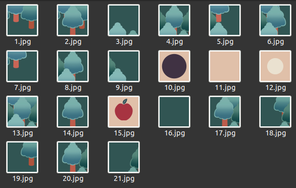

---
# 7월 4주차
##### 정재현
##### 이아영 (게임 이미지 작업)
---

# 1. Actor Critic for Continuous Action Space

<br/>
*[Continuous Action Space Actor Critic Tutorial](https://www.youtube.com/watch?v=kWHSH2HgbNQ&t=153s&ab_channel=SkowstertheGeek)*

위 유튜브 영상에서는 ActorCritic에서 연속적인 행동을 선택하는 방법을 소개하고 있다.
그리고 리차트 서튼과 안드류 바토의 Reinforcement Learning: An Introduction 2nd의 13장 7절 "Policy Parameterization for Continuous Actions"를 보면 잘 알 수 있다.<br/>
*Richard Sutton and Andrew Barto. Reinforcement Learning: An Introduction. MIT Press, 2018. page 335*

## 1.1. 위 알고리즘의 설명

**위 알고리즘은 다음과 같은 순서로 진행된다.**

<br/>
<br/>
<br/>

# 2. 자동차 환경 수정

## 2.1. 학습 가능하도록 코드를 수정

**다음 코드는 사용 예시이다.**<br/>
```python
# PyTorch
import torch
import torch.optim as optim

# import model
from module.ActorCritic.models import ANN_V1
from module.ActorCritic import onestep_ActorCritic

# 환경
from module.envs.CarRacing import RacingEnv_v0
env = RacingEnv_v0()

# 뉴럴넷 모델과 옵티마이저
num_actions = env.num_actions
num_states = env.num_obs
ActorCritic_model = ANN_V1(num_states, num_actions).to(device)
optimizer = optim.Adam(ActorCritic_model.parameters(), lr=0.1e-3)

# 강화학습 모듈 초기화
onestep_AC = onestep_ActorCritic(
    env=env,
    model=ActorCritic_model,
    optimizer=optimizer,
)

# 학습
onestep_AC.train(maxEpisodes=1000)

# 저장
onestep_AC.save("./saved_models/onestep_ActorCritic_RacingEnv_v0.obj")
```

## 2.2 렌더링을 설정할 수 있다.

**렌더링은 학습의 속도를 줄인다. 따라서 렌더링 여부를 선택 할 수 있도록 코드를 수정했다.**

**다음과 같이 모듈 초기화를 하면 된다.**<br/>
```python
# 강화학습 모듈 초기화
onestep_AC = onestep_ActorCritic(
    env=env,
    model=ActorCritic_model,
    optimizer=optimizer,
    isRender={
        'train': False,
        'test': True,
    }
)
```
*학습시에는 렌더링 하지 않고, 테스트 때는 렌더링 한다.*

### 2.2.1. 렌더링에 따른 속도 테스트는 다음과 같이 진행했다.

1. 렌더링의 유무에 관계없이 둘 다 onestep-ActorCritic 알고리즘을 사용했다.
2. 속도를 정확하게 측정하기 위해 테스트 에피소드는 진행하지 않았다.
3. 학습은 1000에피소드까지 진행되었다.
4. 학습의 정도에 따라 에피소드의 길이가 달라질 수 있다. 따라서 실제 비교값과 오차가 예상된다.

**학습이 완료되는데, 렌더링 한 경우는 50분 39초가 걸렸고, 렌더링이 없는 경우는 39분 37초가 걸렸다.**<br/>
**즉, 1000개의 에피소드를 렌더링 없이 진행할 경우 약, 10분 정도 더 빨리끝났다.**

## 2.3. Exploring Starts 요소를 넣었다.

**다음 사진에서 빨간 점이 있는 부분 중 랜덤으로 시작한다.**<br/>
<br/>

이는 에이전트가 더 다양한 경험을 하게 만듦으로써 원활한 학습을 도와준다.

# 3. 다음주 계획

## 3.1. Continuous Action Space로 MountainCar Continuous 문제 해결

OpenAI gym에서는 -1.0 부터 1.0 사이의 실수 값을 행동으로 받는 환경인 Mountain Car Continuous 환경이 존재한다.<br/>
<br/>
*OpenAI Gym Documentaion*

**이 환경에서 학습 가능하도록 위 내용을 바탕으로 코드를 작성하고자 한다. 그리고 학습된 모델을 시연하는 영상 또한 제작하고자 한다.**

## 3.2. Policy의 완전한 분리

지금은 Policy가 모델로부터 완전히 분리되어 있지 않다. 이후의 개발을 위해 분리 작업을 진행하고자 한다.

## 3.3. 미로 환경 작성

이미 미로 환경이 존재하지만, 속도도 느리고 사용자 입장에서 보기 좋은 게임도 아니다. 따라서 사용자의 흥미를 유도하면서, 빠른(렌더링 옵션을 추가하여) 미로탈출 환경 코드를 작성하고자 한다.

**미로에 사용하는 이미지는 '이아영'이 제작한 다음 이미지들을 사용하고자 한다.**<br/>
<br/>

## 3.4. 환경별 데이터 타입 자동 변환 코드 작성

**다른 프로그램에서 제공하는 환경들과 모듈이 쉽게 상호작용 할 수 있도록, 환경에 따라 데이터 타입을 자동으로 변환시켜주는 코드를 작성하고자 한다.**

우선적으로 적용시킬 환경들은 다음과 같다.

1. OpenAI gym
2. 작성자의 모듈에서 제공되는, PyGame으로 제작된 게임들 (미로탈출, 자동차 에이전트 등)
3. Unity 환경 (추후에 Unity 환경도 제작을 예정하고 있으며, 최소 Mac과 Windows에서는 작동하도록 구상중)

## 3.5. 모듈 에러처리 코드 작성

**지금은 모듈의 모든 에러를 처리하지 못한다. 따라서 모듈 에러처리 코드를 작성하고자 한다.**<br/>
이는 다음주의 작업만으로 국한되지 않고, 계속 코드를 작성해 나가면서 할 예정이다.
