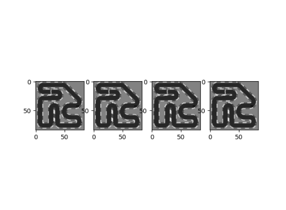
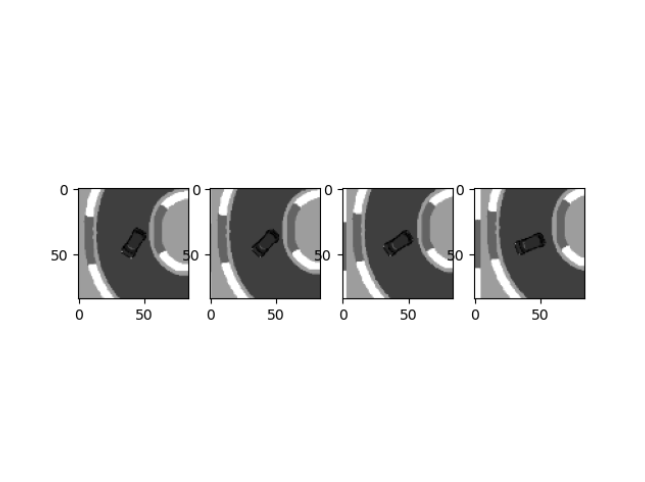
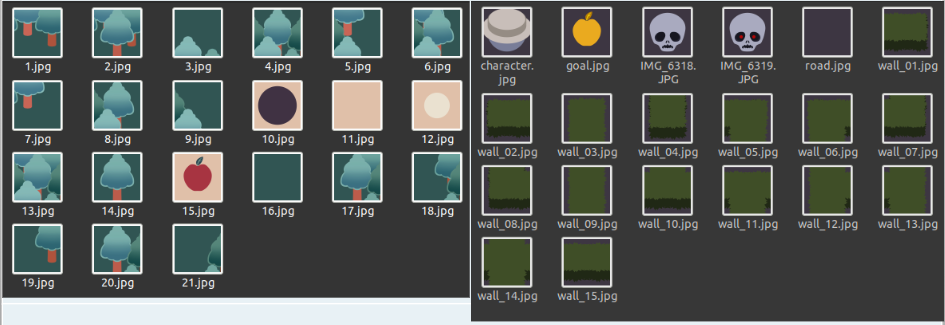
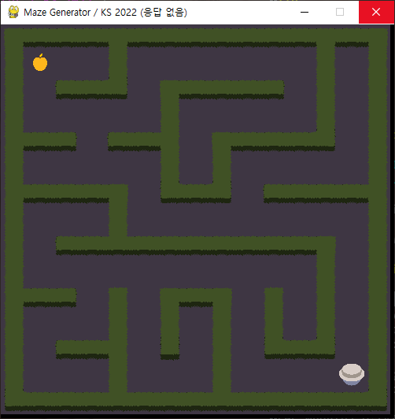
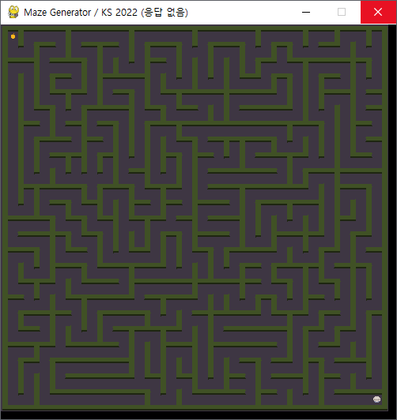
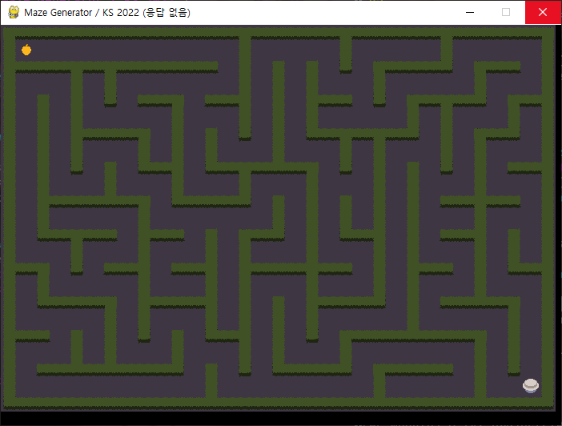
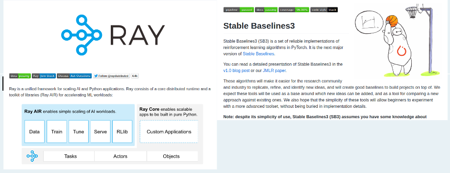

---
# 8월 1주차
##### 정재현
##### 이아영 (게임 이미지 작업)
---

# 1. CarRacing 환경 코드 수정

**다음과 같은 stacked, grayscaled 사진을 사용하기 위해서 코드를 수정했다.** 
처음에 레이저를 사용해서 벽과의 거리를 측정하는 클래스가 CarRacingEnv_v0이고, 다음과 같은 state를 사용하는 CarRacingEnv_v2, CarRacingEnv_v3를 만들었다.

 
*RacingEnv_v2의 상태가 되는 stacked images*

 
*RacingEnv_v3의 상태가 되는 stacked images*

**또한 속도 향상을 위해 적 자동차를 제거하고, 맵에 표시되는 필요없는 출력도 제거했다.**

# 2. Maze 환경 코드 작성

## 2.1. 저번에 제작한 이미지는 벽의 모든  경우의 수를 커버할 수 없다. 따라서 이미지를 다시 제작했다.

 
*왼쪽이 전의 이미지, 오른쪽이 수정 후의 이미지*

## 2.2. 블록의 크기와 화면의 크기를 지정하면 다음과 같이 자동으로 미로를 완성하는 코드를 작성했다.

 
 
 
*화면 크기와, 블록의 사이즈를 지정하면 미로를 자동 생성한다.*

# 3. 다음 주 계획

# 3.1. 연속적인 행동과 여러가지 행동을 동시에 취하는 Policy 연구

모든 환경에 적용하기 위해서는 연속적인 행동과 복합적인 행동을 처리할 수 있는 기능이 필요하다고 저번주 자료에 적었었다. 따라서 계속해서 선행연구를 조사할 예정이다.

그리고 저번주에 작성하기로 한 Continuous Mountain Car 적용은 이 과정이 완료되고 작성하는것이 좋다고 생각했다. 왜냐하면 프로토타입 작성은 간단하지만 모듈에 넣어서 기존 Policy들과 잘 상호작용하는 코드 작성은 많이 복잡하기 때문이다.

# 3.2. 코드 리팩토링

속도 비교와 위 3.1.의 문제를 어떻게 해결했는지 확인하기 위해 다음 모듈들을 사용해보고자 한다.

 
[Ray](https://github.com/ray-project/ray) 
[stable-baselines3](https://github.com/DLR-RM/stable-baselines3) 
