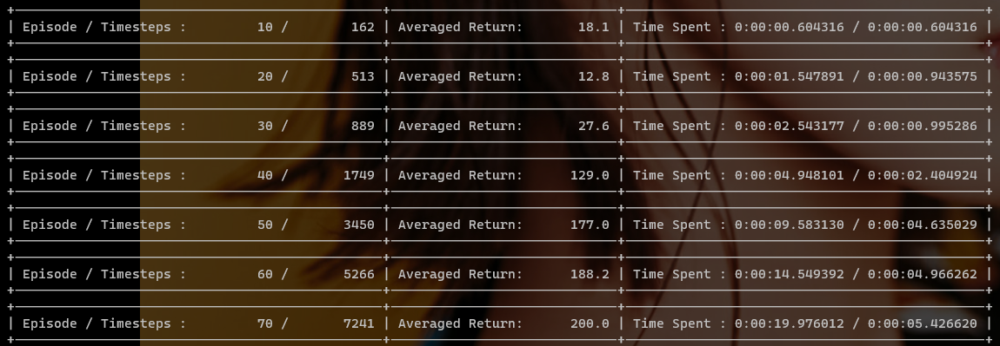
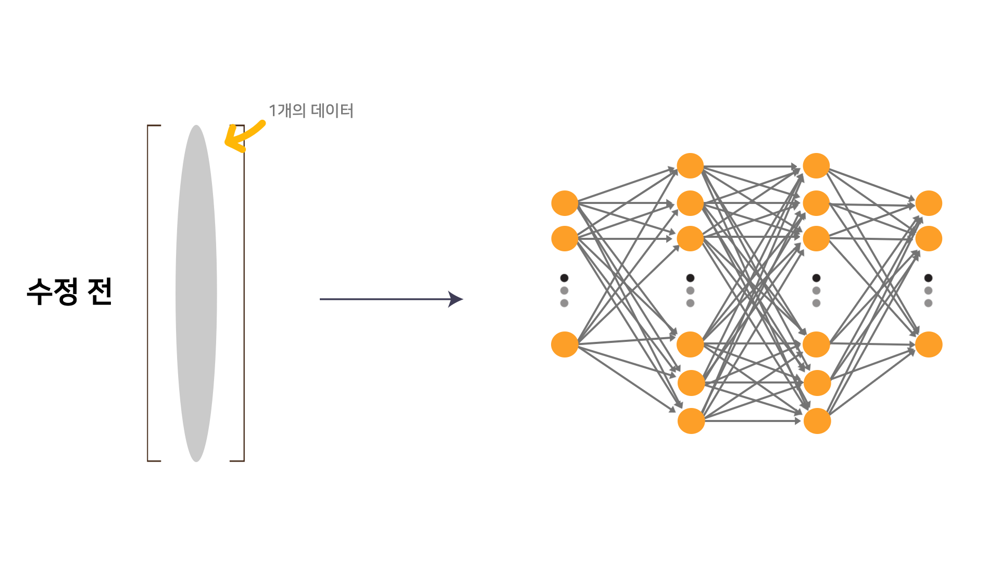
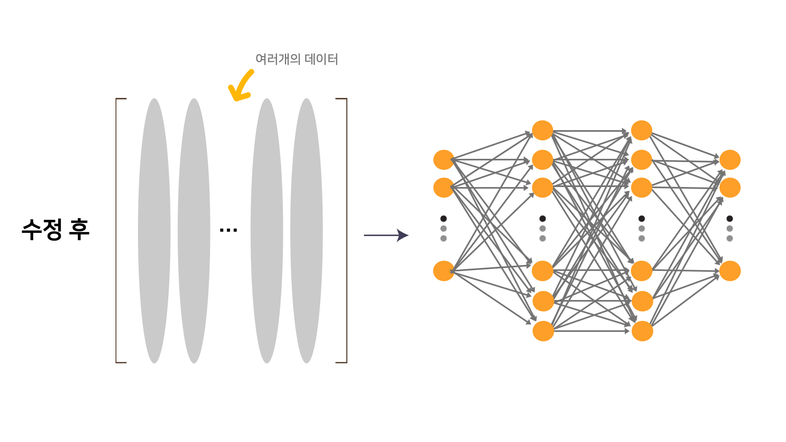
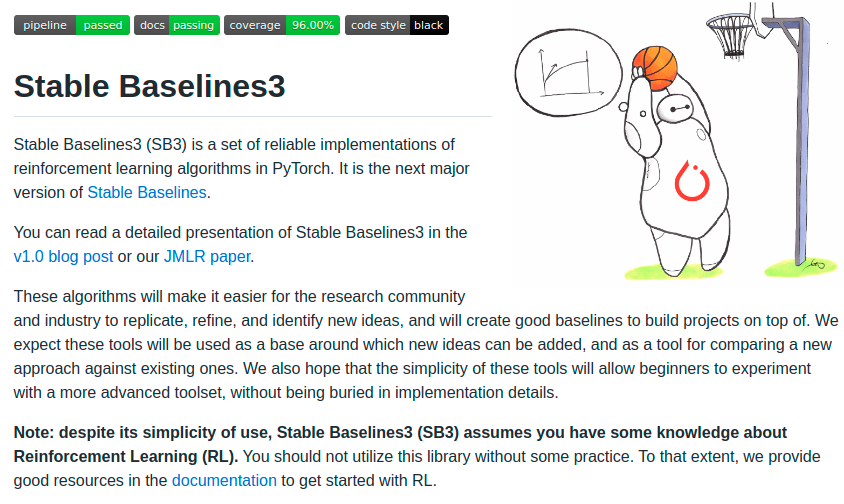
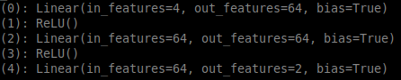
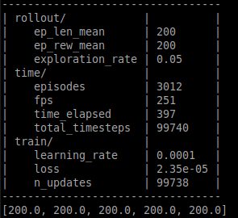
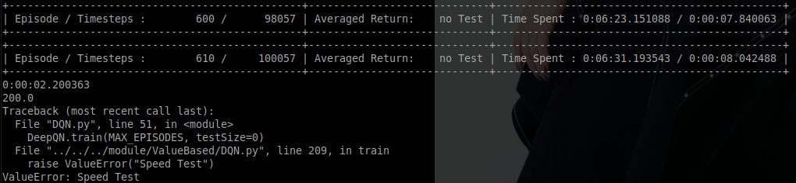
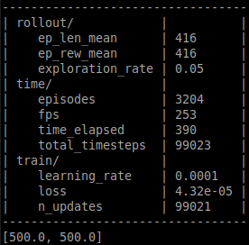
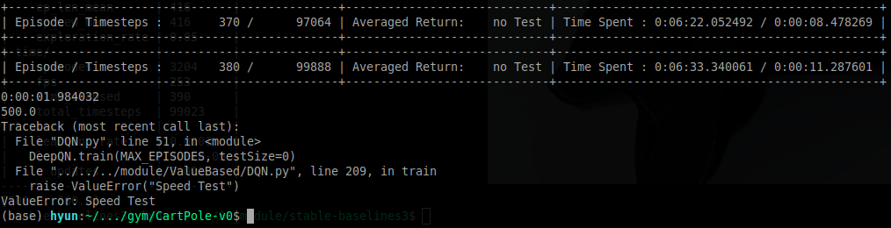

---
# 8월 2주차
##### 정재현
##### 이아영 (모든 이미지 작업)
---

# 1. 더욱 빠른 학습을 위해 코드를 수정

 
*수정 후, CartPole에 테스트했다. 약 20초 후 Optimal Solution을 찾았다.*

## 1.1. 수정 전의 처리 방식

 

## 1.2. 수정 후의 처리 방식

 

**수정 후의 방식은 여러개의 데이터를 한번에 뉴럴 넷에 넣고, 한 번의 forward를 진행한다.**

> 데이터 개수를 n이라고 하면, n번의 행렬 연산이 필요했지만, 수정 후, 한 번의 행렬연산으로 Action Value와 Policy 등을 얻을 수 있다.

# 2. DQN을 사용했을 때, stable-baselines3와 작성자 모듈의 속도 비교

 
<https://github.com/DLR-RM/stable-baselines3> 

**stable-baseline3은 독일 항공우주센터에서 개발한 강화학습 모듈이다.** 
저번 주 자료에 나와있듯이, 작성자의 모듈을 다른 모듈과 비교한 적이 없다. 따라서, 인기있는 강화학습 모듈 중 하나인 stable-baselines3와 속도비교를 하고자 한다.

## 2.1. 비교환경

완벽한 속도 비교를 위해 다음과 같은 조건으로 테스트를 진행했다. 
- 두 모듈 모두 작성자의 노트북으로 테스트하며, cpu만을 사용한다.
- Experience Replay를 위한 버퍼의 크기를 1만, 그리고 Batch의 크기를 100으로 한다.
- 한 스텝마다 Policy를 업데이트, 즉, 한 번의 학습 스텝을 진행한다.
- 환경은 OpenAI gym의 CartPole-v0, 그리고 CartPole-v1을 사용한다.
- 10만 번의 스텝 후, 걸린 시간을 비교한다.
- Policy 뉴럴넷은 stable-baselines3에서 제공하는 기본 모양을 똑같이 적용했다.

 
*실제 뉴럴 넷 모양*

## 2.2. CartPole-v0 환경에서의 비교

### 2.2.1. stable-baselines3

 

**time_elapsed를 보면 397초가 소요됬음을 알 수 있다. 즉, 6분 37초가 걸렸다**

### 2.2.2. 작성자의 모듈

 
*작성자에 모듈에서 나온 결과, 에러는 테스트를 위해 작성했다.*

**Time Spent에 아래 출력된 시간을 더하면 6분 34초 정도가 걸렸다.**

그리고 마지막 출력은 보상의 합을 의미한다. 두 모듈 모두 Optimal Solution, 즉 200을 찾았다.

## 2.2. CartPole-v1 환경에서의 비교

### 2.2.1. stable-baselines3

 

**time_elapsed를 보면 390초가 소요됬음을 알 수 있다. 즉, 6분 30초가 걸렸다**

### 2.2.2. 작성자의 모듈

 
*작성자에 모듈에서 나온 결과, 에러는 테스트를 위해 작성했다.*

**Time Spent에 아래 출력된 시간을 더하면 6분 35초 정도가 걸렸다.**

그리고 마지막 출력은 보상의 합을 의미한다. 두 모듈 모두 Optimal Solution, 즉 500을 찾았다.

## 2.3. 결론

이 외에도 여러 번의 테스트를 거쳐서 시간을 비교해 보았다. 
**믿기지는 않지만, DQN 알고리즘으로 테스트 했을 때, stable-baselines3와 작성자 모듈의 속도차이는 거의 없다.** 
**그리고 같은 알고리즘을 사용하기 때문에 학습 결과는 당연히 같다.**

## 2.4. 작성자 모듈의 개선점

### 2.4.1. Timestep 단위 학습으로 코드 수정

위 테스트에서 에러를 발생기켜 억지로 10만번의 timestep후 멈추게 만들었다. 왜냐하면 작성자의 모듈은 에피소드 단위로 학습을 진행하기 때문이다. 
이러한 방법은 Continuous Task에 적용시키기가 어렵다. **따라서 timestep 단위로 학습을 진행하도록 코드를 수정하고자 한다.**

**그리고 stable-baselines3의 train_freq와 같이 몇 스텝 마다 학습을 진행할 지, 몇 epoch를 진행할 지 결정 가능한 파라미터를 만들고자 한다.**

### 2.4.2. 뉴럴 넷 업데이트를 몇 스텝 후에 진행할 지 결정하는 파라미터 추가

Batch 크기가 100인 경우 데이터가 1개만 있다면, 어떻게 학습을 진행할 것인가. 작성자는 이러한 문제를 100개가 모이기 전 까지는 모든 데이터를 이용하고 100개 이상의 데이터가 모였을 때, 랜덤하게 100개를 샘플링하는 방식으로 문제를 해결했다.

**하지만, stable-baselines3는 위와 같은 문제로 learning_starts 파라미터로 해결했다. 이는, 학습이 몇 스텝 이후 실행될 지 결정하는 파라미터이다.**

### 2.4.3. verbose 파라미터 추가

stable-baselines3와 같이, 출력의 정도를 결정하는 verbose 파라미터를 추가하고자 한다.

