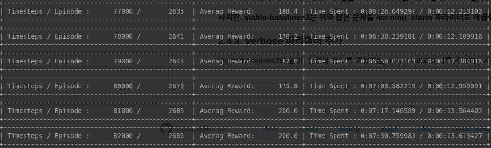
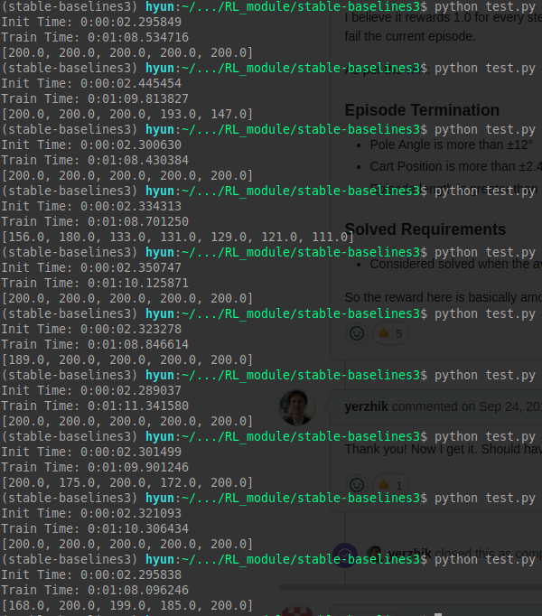
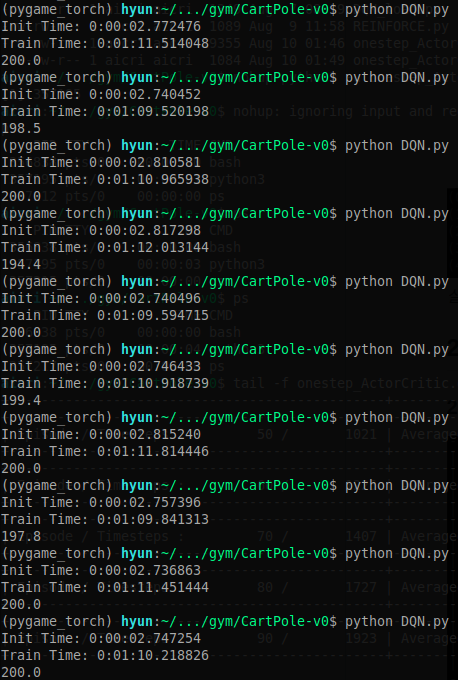

---
# 8월 2주차
##### 정재현
##### 이아영 (모든 이미지 작업)
---

# 1. 더욱 빠른 학습을 위해 코드를 수정

<br/>
*수정 후, CartPole-v0에 테스트했다. 약 20초 후 Optimal Solution을 찾았다.*

## 1.1. 수정 전의 처리 방식

<br/>

## 1.2. 수정 후의 처리 방식

<br/>

**수정 후의 방식은 여러개의 데이터를 한번에 뉴럴 넷에 넣고, 한 번의 forward를 진행한다.**

> 데이터 개수를 n이라고 하면, n번의 행렬 연산이 필요했지만, 수정 후, 한 번의 행렬연산으로 Action Value와 Policy 등을 얻을 수 있다.

# 2. DQN을 사용했을 때, stable-baselines3와 작성자 모듈의 속도 비교

<br/>
<https://github.com/DLR-RM/stable-baselines3><br/>

**stable-baseline3은 독일 항공우주센터에서 개발한 강화학습 모듈이다.**<br/>
저번 주 자료에 나와있듯이, 작성자의 모듈을 다른 모듈과 비교한 적이 없다. 따라서, 인기있는 강화학습 모듈 중 하나인 stable-baselines3와 속도비교를 하고자 한다.

## 2.1. 비교환경

완벽한 속도 비교를 위해 다음과 같은 조건으로 테스트를 진행했다.<br/>
- 두 모듈 모두 작성자의 노트북으로 테스트하며, cpu만을 사용한다.
- Experience Replay를 위한 버퍼의 크기를 1만, 그리고 Batch의 크기를 100으로 한다.
- 한 스텝마다 Policy를 업데이트, 즉, 한 번의 학습 스텝을 진행한다.
- 환경은 OpenAI gym의 CartPole-v0, 그리고 CartPole-v1을 사용한다.
- 10만 번의 스텝 후, 걸린 시간을 비교한다.
- Policy 뉴럴넷은 stable-baselines3에서 제공하는 기본 모양을 똑같이 적용했다.

<br/>
*실제 뉴럴 넷 모양*

## 2.2. CartPole-v0 환경에서의 비교

### 2.2.1. stable-baselines3

<br/>

**time_elapsed를 보면 397초가 소요됬음을 알 수 있다. 즉, 6분 37초가 걸렸다**

### 2.2.2. 작성자의 모듈

<br/>
*작성자에 모듈에서 나온 결과, 에러는 테스트를 위해 작성했다.*

**Time Spent에 아래 출력된 시간을 더하면 6분 34초 정도가 걸렸다.**

그리고 마지막 출력은 보상의 합을 의미한다. 두 모듈 모두 Optimal Solution, 즉 200을 찾았다.

## 2.2. CartPole-v1 환경에서의 비교

### 2.2.1. stable-baselines3

<br/>

**time_elapsed를 보면 390초가 소요됬음을 알 수 있다. 즉, 6분 30초가 걸렸다**

### 2.2.2. 작성자의 모듈

<br/>
*작성자에 모듈에서 나온 결과, 에러는 테스트를 위해 작성했다.*

**Time Spent에 아래 출력된 시간을 더하면 6분 35초 정도가 걸렸다.**

그리고 마지막 출력은 보상의 합을 의미한다. 두 모듈 모두 Optimal Solution, 즉 500을 찾았다.

## 2.3. 결론

이 외에도 여러 번의 테스트를 거쳐서 시간을 비교해 보았다.<br/>
**믿기지는 않지만, DQN 알고리즘으로 테스트 했을 때, stable-baselines3와 작성자 모듈의 속도차이는 거의 없다.**<br/>
**그리고 같은 알고리즘을 사용하기 때문에 학습 결과는 당연히 같다.**<br/>
**하지만 강화학습은 환경의 영향을 많이 받는다. 아무리 모듈의 속도가 빨라도 환경에서 데이터를 제공하는 속도가 느리면 전체적인 학습 속도는 느려진다는 점을 간과해서는 안된다.**

## 2.4. 작성자 모듈의 개선점

### 2.4.1. Timestep 단위 학습으로 코드 수정

위 테스트에서 에러를 발생기켜 억지로 10만번의 timestep후 멈추게 만들었다. 왜냐하면 작성자의 모듈은 에피소드 단위로 학습을 진행하기 때문이다.<br/>
이러한 방법은 Continuous Task에 적용시키기가 어렵다. **따라서 timestep 단위로 학습을 진행하도록 코드를 수정하고자 한다.**

**그리고 stable-baselines3의 train_freq와 같이 몇 스텝 마다 학습을 진행할 지, 몇 epoch를 진행할 지 결정 가능한 파라미터를 만들고자 한다.**

### 2.4.2. 뉴럴 넷 업데이트를 몇 스텝 후에 진행할 지 결정하는 파라미터 추가

Batch 크기가 100인 경우 데이터가 1개만 있다면, 어떻게 학습을 진행할 것인가. 작성자는 이러한 문제를 100개가 모이기 전 까지는 모든 데이터를 이용하고 100개 이상의 데이터가 모였을 때, 랜덤하게 100개를 샘플링하는 방식으로 문제를 해결했다.

**하지만, stable-baselines3는 위와 같은 문제를 learning_starts 파라미터로 해결했다. 이는, 학습이 몇 스텝 이후 실행될 지 결정하는 파라미터이다.**

### 2.4.3. verbose 파라미터 추가

stable-baselines3와 같이, 출력의 정도를 결정하는 verbose 파라미터를 추가하고자 한다.

# 3. stable-baselines3에서 유용하다고 생각되는 파라미터 추가

## 3.1. Timestep 단위로 학습을 진행하도록 코드 수정

**다음은 수정 후에 학습이 진행되는 그림이다. timestep 단위로 진행하고 있음을 알 수 있다.**<br/>
<br/>

**학습 메소드 또한 다음과 같이 사용 가능하다.**<br/>
```python
DQN.train(trainTimesteps=100000)
```

## 3.2. GradientStepPer, epoch, trainStarts 파라미터 추가

각각의 파라미터는 다음과 같은 역할을 한다.<br/>
- GradientStepPer: 뉴럴넷의 업데이트를 몇 스텝마다 진행할지 결정하는 양의 정수 파라미터
- epoch: 주어진 Replay Memory에서 몇번의 epoch을 진행할지 결정하는 양의 정수 파라미터
- trainStarts: 2.4.2.에서 stable-baselines3의 learning_starts 파라미터와 정확히 같은 역할을 하는 양의 정수 파라미터

# 4. 모듈 개선 후, stable-baselines3와 더 정확한 성능 비교

## 4.1. 비교 환경

- 전과 동일하게, 작성자의 노트북에서 테스트하고, cpu만 사용한다.
- GradientStepPer, epoch, trainStarts는 각각 4, 1, 50000으로 stable-baselines3의 기본 값과 일치하게 설정했다.
- Experience Replay를 위한 버퍼 크기를 stable-baselines3의 기본 값과 일치하는 100000으로 설정했다.
- Batch 크기는 stable-baselines3의 기본 값인 32로 설정했다.
- 환경은 OpenAI gym의 CartPole-v0를 사용했다.
- 10만 번의 스텝 후, 걸린 시간을 비교한다.
- Policy 뉴럴 넷은 같은 모양을 사용했다.

## 4.2. 비교하는 코드

### 4.2.1 stable-baselines3

```python
# 시간 측정
from datetime import datetime

# 시작 시간
startTime = datetime.now()

import gym
from stable_baselines3 import DQN
env = gym.make("CartPole-v0")

model = DQN("MlpPolicy", env, verbose=0) # 학습 중 아무것도 출력하지 않도록 설정

# 모듈 초기화가 끝난 시간
print(f"Init Time: {datetime.now() - startTime}")

# 학습이 시작되는 시간
startTrainTime = datetime.now()

model.learn(total_timesteps=10_0000, n_eval_episodes=0)

# 학습이 끝나는 시간
print(f"Train Time: {datetime.now() - startTrainTime}")

# 성능 비교를 위한 테스트
obs = env.reset()
rewards = 0
returns = []
done_num = 0
for i in range(1000):
    action, _states = model.predict(obs, deterministic=True)
    obs, reward, done, info = env.step(action)
    rewards += reward
    env.render()
    if done:
      obs = env.reset()
      returns.append(rewards)
      rewards = 0
      done_num += 1
      if done_num == 10:
          break
      
print(returns)

env.close()
```

### 4.2.2. 작성자의 모듈

```python
# 시간 측정
from datetime import datetime

# 시작 시간
startTime = datetime.now()

# 파이토치
import torch
import torch.optim as optim

# 작성자의 모듈 임포트
from module.ValueBased.models import ANN_V3
from module.ValueBased import DQN

# 학습 환경 설정
import gym
env = gym.make('CartPole-v0')
num_actions = env.action_space.n
num_states = env.observation_space.shape[0]

model = ANN_V3(num_states, num_actions)
optimizer = optim.Adam(model.parameters(), lr=1e-3)

# 작성자의 모듈 설정은 stable-baselines3와 같도록 설정
DeepQN = DQN(
    model=model, # torch models for policy and value funciton
    env=env,
    optimizer=optimizer, # torch optimizer
    maxMemory=100000,
    numBatch=32,
    verbose=0, # 학습 중 아무것도 출력하지 않도록 설정
)

# 모듈 초기화가 끝난 시간
print(f"Init Time: {datetime.now() - startTime}")

# 학습이 시작되는 시간
startTrainTime = datetime.now()

DeepQN.train(trainTimesteps=100000, testSize=0)

# 학습이 끝나는 시간
print(f"Train Time: {datetime.now() - startTrainTime}")

# 10번의 테스트를 진행한 다음 평균적인 성능을 출력 
print(DeepQN.test(testSize=10))
```

## 4.3. 결과

<br/>
*stable-baselines3에 10번의 테스트를 진행*

<br/>
*작성자의 모듈에 10번의 테스트를 진행*

**10번 실행하여 평균을 계산하면 다음과 같은 결과가 나온다.**

### 4.3.1. stable-baselines3 결과

**모듈 초기화: 2.33초**<br/>
**학습: 1분 9.41초**<br/>
**평균적 보상합: 188.25**

### 4.3.1. 작성자 모듈의 결과

**모듈 초기화: 2.77초**<br/>
**학습: 1분 10.79초**<br/>
**평균적 보상합: 199.01**

### 평균적 차이

**10만 번의 timestep을 10번 진행했을 때, 평균적으로 stable-baselines3가 약, 1.82초 빨랐다.**

# 5. 다음주 계획

## 5.1. 연속적이면서 복수개인 행동 적용을 위한 연구

**저번 주, 자료에도 나와있듯이 연구를 이어나가고자 한다.**

## 5.2. Ray모듈과 속도 비교 및 작성자의 모듈 개선

<br/>
*Ray*<br/>
<https://github.com/ray-project/ray>

**이번에는 Ray모듈과 작성자의 모듈의 성능을 비교하고, 개선점을 찾고자 한다.**
