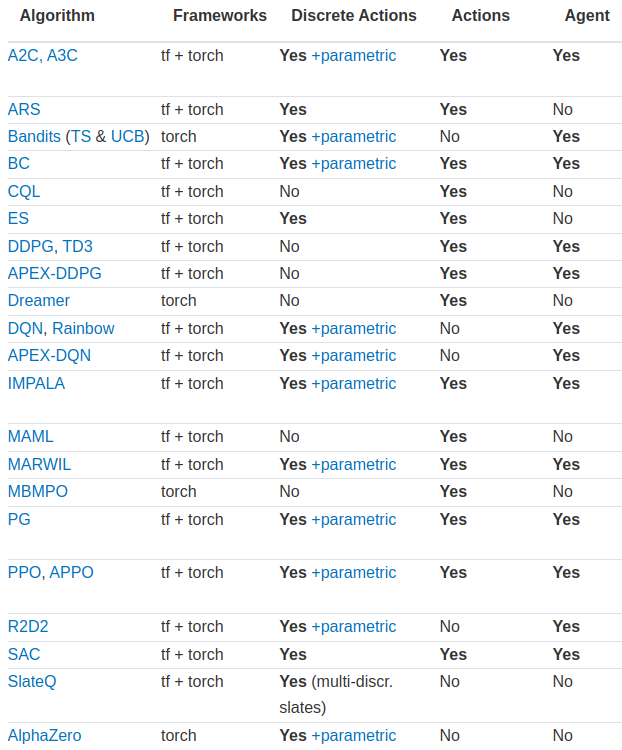
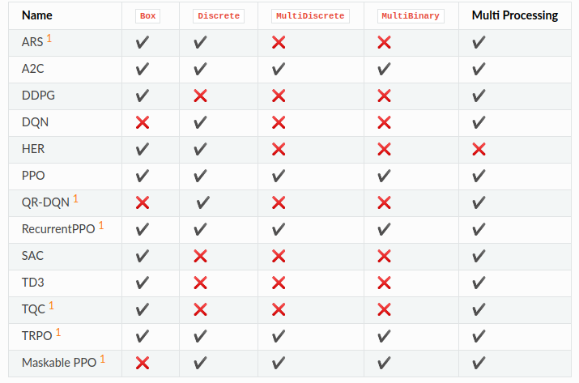

---
# 8월 2주차
##### 정재현
##### 이아영 (모든 이미지 작업)
---

# 1. 복수개의 행동을 테스트 하기 위한 RacingEnv_v4를 작성

**이 전의 RacingEnv_v0, RacingEnv_v2, RacingEnv_v3는 복수개의 행동을 취할 수가 없다. 즉, 좌회전, 직진, 우회전 중 하나의 행동만이 선택 가능하다.**

하지만, 이번에 테스트를 위해, 다음과 같은 형태의 행동을 받는 환경 RacingEnv_v4를 작성했다.<br/>
[액셀(0 or 1), 좌회전(0) 또는 직진(1) 또는 우회전(2)]<br/>
> [1, 2] = 액셀을 밟은 상태로 우회전<br/>
> [0, 1] = 액셀을 밟지 않고 직진<br/>
> [1, 0] = 액셀을 밟은 상태로 좌회전<br/>

# 2. DQN을 사용했을 때, Ray Rllib 모듈과 작성자의 모듈 속도 비교

<br/>
*Ray* <https://github.com/ray-project/ray>

**Ray는 UC Berkeley RISE Lab에서 보편적인 분산 컴퓨팅 프레임워크 개발을 위해 시작된 오픈소스 프로젝트다.**<br/>
이 프로젝트에서 제공하는 라이브러리 중 하나인, Rllib은 강화학습을 위한 라이브러리이다. 이번 주는 Rllib과 작성자의 모듈의 속도를 비교해보고자 한다.

## 2.1. 비교 환경

**저번주와 동일하다**<br/>
- 작성자의 노트북에서 테스트하고, cpu만 사용한다.
- GradientStepPer, epoch, trainStarts는 각각 4, 1, 50000으로 stable-baselines3의 기본 값과 일치하게 설정했다.
- Experience Replay를 위한 버퍼 크기를 stable-baselines3의 기본 값과 일치하는 100000으로 설정했다.
- Batch 크기는 stable-baselines3의 기본 값인 32로 설정했다.
- 환경은 OpenAI gym의 CartPole-v0를 사용했다.
- 10만 번의 스텝 후, 걸린 시간을 비교한다.
- Policy 뉴럴 넷은 같은 모양을 사용했다.

## 2.2. Ray Rllib의 파라미터는 너무 많고 복잡하다. 최대한 맞춘 코드는 다음과 같다.

```python
# 시간 측정
from datetime import datetime

# 시작 시간
startTime = datetime.now()

import ray
import ray.rllib.agents.dqn as dqn
from ray.tune.logger import pretty_print

ray.init()

# 모듈 초기화에 걸린 시간
print(f"Init Time: {datetime.now() - startTime}")

# === 저번주의 테스트와 동일하게 파라미터 설정 ===
config = dqn.DEFAULT_CONFIG.copy()
# gpu는 사용하지 않는다.
config["num_gpus"] = 0
# 하나의 에이전트만 실행한다.
config["num_workers"] = 1
config["lr"] = 0.001
config["train_batch_size"] = 32
config["exploration_config"] = {
    'type': 'EpsilonGreedy',
    'initial_epsilon': 0.99,
    'final_epsilon': 0.0001,
    'epsilon_timesteps': 10000
}
config["dueling"] = False
config["double_q"] = False
config["replay_buffer_config"]["capacity"] = 100000
config["replay_buffer_config"]["learning_starts"] = 50000
config["model"]["fcnet_hiddens"] = [64]
config["model"]["fcnet_activation"] = 'relu'
# 작성자의 모듈과 동일하게 PyTorch를 사용한다.
config["framework"] = "torch"
# ================================================

# 학습이 시작되는 시간
startTrainTime = datetime.now()

trainer = dqn.DQNTrainer(config=config, env="CartPole-v0")

# 한 번의 반복에 1000번의 timestep이 진행된다. 따라서 100 * 1000 = 10만 번의 timestep이 진행된다.
for i in range(100):
    if i < 99:
        trainer.train()
    else:
        result = trainer.train()

# 학습이 끝나는 시간
print(f"Train Time: {datetime.now() - startTrainTime}")

# 마지막 학습에서 얻어진 결과 출력
print(pretty_print(result))
```

## 2.3. Ray Rllib 에서의 결과

**다음은 테스트의 결과이다. 저번과 같이 10번을 실행했다.**

```
Init Time: 0:00:08.565286
Train Time: 0:08:52.916184
episode_reward_mean: 126.99

Init Time: 0:00:07.538738
Train time: 0:08:54.682674
episode_reward_mean: 151.92

Init Time: 0:00:08.446258
Train time: 0:08:57.942791
episode_reward_mean: 107.12

Init Time: 0:00:07.467765
Train time: 0:08:54.896839
episode_reward_mean: 152.27

Init Time: 0:00:07.527146
Train time: 0:08:57.285905 
episode_reward_mean: 123.94

Init Time: 0:00:07.561589
Train time: 0:08:54.741637
episode_reward_mean: 122.22

Init Time: 0:00:07.276091
Train time: 0:08:35.722178
episode_reward_mean: 127.27

Init Time: 0:00:07.321795
Train time: 0:08:46.489730
episode_reward_mean: 130.19

Init Time: 0:00:08.113442
Train time: 0:08:33.539747
episode_reward_mean: 133.75

Init Time: 0:00:07.665596
Train time: 0:09:35.174234
episode_reward_mean: 111.54
```

**모듈 초기화: 7.75초**<br/>
**학습: 8분 54.34초**<br/>
**평균적 보상합: 128.72**

**저번 주에 작성한 작성자 모듈의 결과는 다음과 같다.**

**모듈 초기화: 2.77초**<br/>
**학습: 1분 10.79초**<br/>
**평균적 보상합: 199.01**

## 2.4. 평균적 차이

**10만 번의 timestep을 진행했을 때, 작성자의 모듈이 7분 49초 정도 빨랐다.**

## 2.5. Ray Rllib은 Industry-Grade Reinforcement Learning 모듈

위에서 언급했듯이, Ray는 분산 컴퓨팅 프래임워크 기반이다. 즉, 병렬 처리를 특기로 하는 모듈이다.<br/>
그리고 Ray Rllib은 여러 환경과, 에이전트를 동시에 실행하는 옵션들을 가지고 있다.<br/>
**리소스가 충분하다면 Ray Rllib은 엄청난 성능을 낼 수 있다. 하지만, 가벼운 테스트에는 적합하지 않다고 결론내렸다.**<br/>
실제로 Ray Rllib은 Industry-Grade Reinforcement Learning 모듈이라 소개하고 있다.

## 3. 다른 알고리즘의 필요성

지금 까지 비교한 두 모듈은 알고리즘 표를 다음과 같이 제공한다.

<br/>
*Ray Rllib*: <https://docs.ray.io/en/latest/rllib/rllib-algorithms.html>

<br/>
*stable-baselines3*: <https://stable-baselines3.readthedocs.io/en/master/guide/algos.html>

## 3.1. stable-baselines3의 표에서 MultiBinary열이 복수개 행동의 가능 여부

**즉, A2C, TRPO, 그리고 PPO 계열 만이 복수개의 행동을 지원한다.**

따라서, 내가 원하는 모든 행동을 처리할 수 있는 모듈을 만들기 위해서는 새로운 알고리즘을 추가할 필요가 있다고 판단했다.

## 4. 다음주 계획

## 4.1. A2C(Advantage Actor Cirtic) 알고리즘 구현

**복수개의 행동을 취하기 위해서는 새로운 알고리즘이 필요하다고 판단했다. 따라서 A2C 알고리즘을 모듈에 추가하고자 한다.**

A2C를 선택한 이유는 이미 onestep Actor Critic 알고리즘을 구현했기 때문에 빠르게 구현 가능하다고 판단했기 때문이다.

## 4.2. 미로 환경을 학습 가능하도록 수정, 그리고 새로운 환경에 대한 조사

지금 상황에서는 유니티 개발자를 따로 구해서 Unity 환경을 만들 필요가 있다. 하지만 그 전에 이미 있는 다른 강화학습 환경에 대하여 작성자의 모듈이 작동하도록 코드를 수정해 나가고자 한다.

## 5. 연구의 방향성

## 5.1. stable-baselines3과 작성자의 모듈의 유사점이 많다고 판단

테스트를 하면서 stable-baselines3가 작성자의 모듈과 유사점이 많다고 판단했다.<br/>
**따라서 stable-baselines3를 밴치마킹하여, 더욱 빠르고, 사용하기 간단한 모듈을 작성하고자 한다.**

## 5.2. 한국어 사용자들을 고려한 README 파일과 강의 작성

**중학생, 고등학생 사용자를 고려한다면, 한국어 README 파일이 필요하고, 학습을 목적으로한 난이도 별 강의가 필요하다고 생각한다 .**
