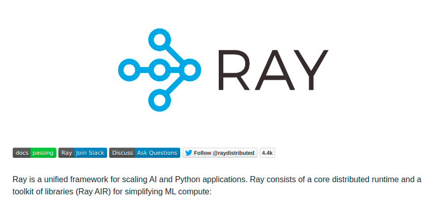

---
# 8월 2주차
##### 정재현
##### 이아영 (모든 이미지 작업)
---

# 1. 복수개의 행동을 테스트 하기 위한 RacingEnv_v4를 작성

**이 전의 RacingEnv_v0, RacingEnv_v2, RacingEnv_v3는 복수개의 행동을 취할 수가 없다. 즉, 좌회전, 직진, 우회전 중 하나의 행동만이 선택 가능하다.**

하지만, 이번에 테스트를 위해, 다음과 같은 형태의 행동을 받는 환경 RacingEnv_v4를 작성했다. 
[액셀(0 or 1), 좌회전(0) 또는 직진(1) 또는 우회전(2)] 
> [1, 2] = 액셀을 밟은 상태로 우회전 
> [0, 1] = 액셀을 밟지 않고 직진 
> [1, 0] = 핵셀을 밟은 상태로 좌회전 

# 2. DQN을 사용했을 때, Ray Rllib 모듈과 작성자의 모듈 속도 비교

 
*Ray* <https://github.com/ray-project/ray>

**Ray는 UC Berkeley RISE Lab에서 보편적인 분산 컴퓨팅 프레임워크 개발을 위해 시작된 오픈소스 프로젝트다.** 
이 프로젝트에서 제공하는 라이브러리 중 하나인, Rllib은 강화학습을 위한 라이브러리이다. 이번 주는 Rllib과 작성자의 모듈의 속도를 비교해보고자 한다.
