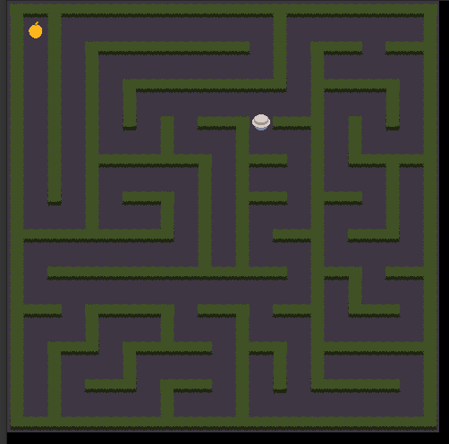
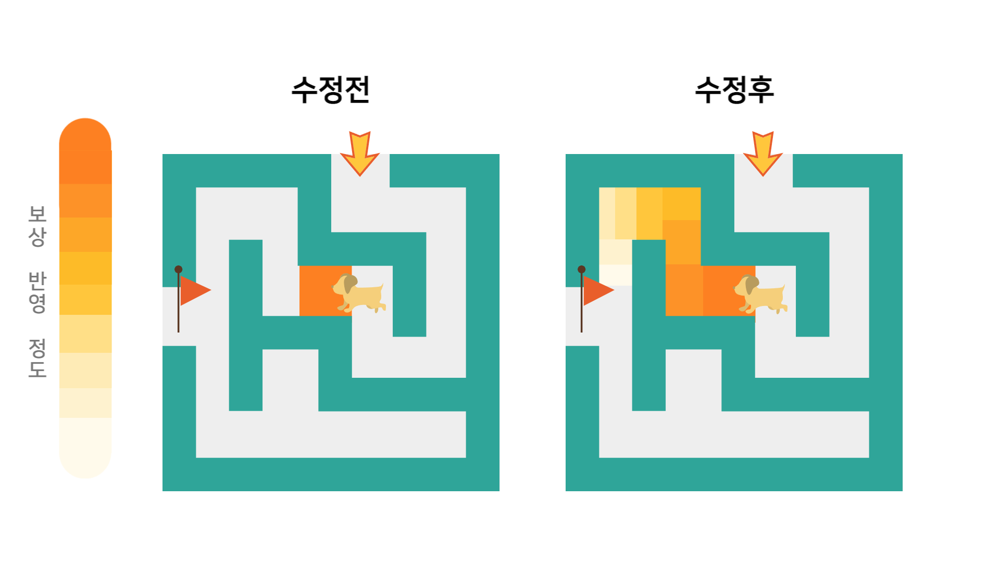
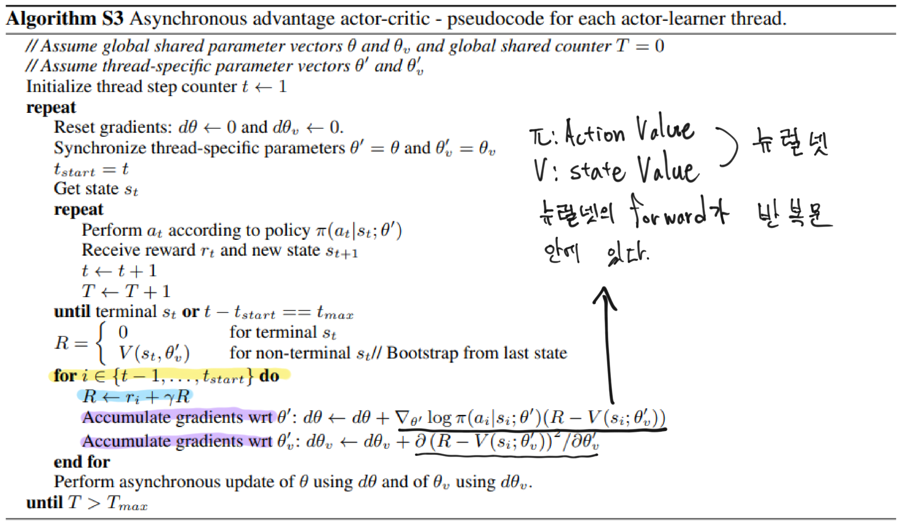
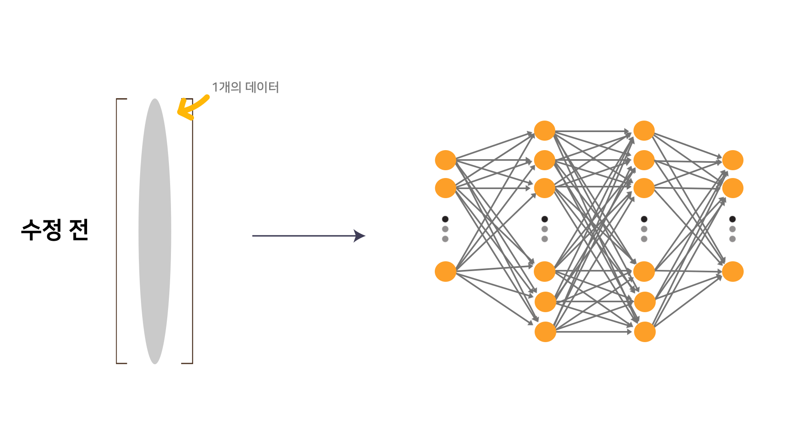
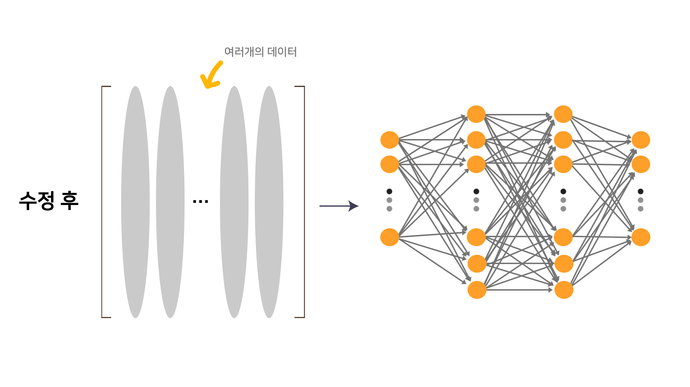

---
# 8월 4주차
##### 정재현
##### 이아영 (모든 이미지 작업)
---

# 1. 미로 환경 MazeEnv_v0 제작

<br/>
*실행 중의 사진*

**다음은 사용 예시 코드이다.**

```python
from module.envs.Maze import MazeEnv_v0
from random import choice 

env = MazeEnv_v0()

while True:
    env.render()  # 렌더링 여부를 결정 가능하다.
    action = choice([0, 1, 2, 3])  # 동, 서, 남, 북 중에 랜덤으로 선택
    next_state, reward, done, action = env.step(action)  # 한 번의 Timestep
```

# 2. A2C 알고리즘 코드 작성

## 2.1. 기존의 onestep_ActorCritic.py 파일을 수정하여 작성

기존의 onestep_ActorCritic 파일은 한 번의 스텝 후에 업데이트를 진행하는 함수였다.<br/>
하지만 수정 후, n 번의 스텝 후 n 스텝 보상을 사용하여 수정하도록 변경되었다.<br/>
**다음은 이 과정을 설명하는 그림이다.**

<br/>

## 2.2. 알고리즘의 의사코드와 작성한 코드의 작동 방식의 차이

<br/>

### 2.2.1. 반복문 (노란색)

**반복문을 최대한 생락하고자 노력했다.**

### 2.2.2. 보상합 계산 (파란색)

**유일하게 반복하는 부분이다.**

### 2.2.3. Action Value, State Value 계산 방식

<br/>
**의사코드는 다음과 같은 연산을 반복한다.**

<br/>
**작성자가 만든 코드는 처음 스텝부터 마지막 스텝까지의 데이터를 한번에 넣어서, 위 연산을 한 번만 진행한다.**

> 10개의 스텝을 사용하여 학습을 진행한다고 가정하면, forward pass의 횟수는 다음과 같다.<br/>
> **논문의 의사코드**: Action Value 10번, State Value 20번, 즉, **30번의 forward pass**를 진행한다.<br/> 
> **작성자의 코드**: Action Value 1번, State Value 2번, 즉, **3번의 foward pass**를 진행한다.<br/>

### 2.2.4. Gradient 축적 방식 (보라색)

**논문의 방식: 반복 횟수 만큼 loss의 Gradient를 계산하고 더한다.**<br/>
**작성자의 코드: 한번에 loss를 계산하고, 값을 다 더한다. 그리고 Back Propagation을 진행한다.**<br/><br/>

**Chain Rule은 작성자의 코드가 논문의 방식과 같음을 설명한다. (A2C 만)**<br/>

# 3. 다음 주 계획

## 3.1. stable-baselines3와 A2C 알고리즘 속도비교

**stable-baselines3와 DQN 알고리즘의 속도 비교는 이미 진행했다. 따라서 이번에 작성한 A2C를 비교하고자 한다.**

## 3.2. 복수 행동 테스트가 가능한 환경 찾기

**A2C 알고리즘을 적용하기 위한 환경을 찾고자 한다.**
