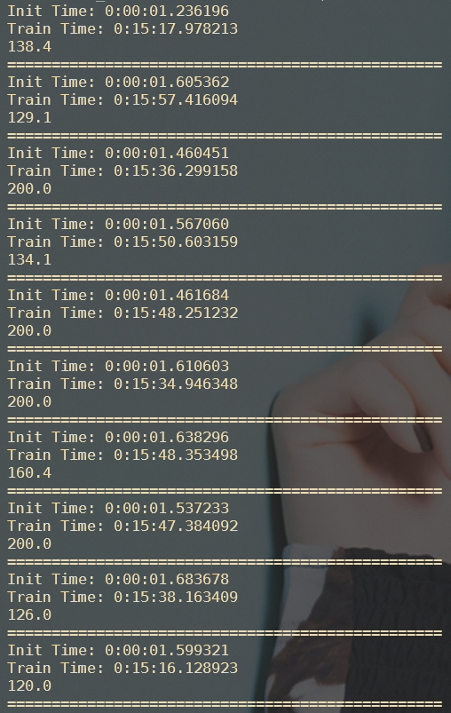
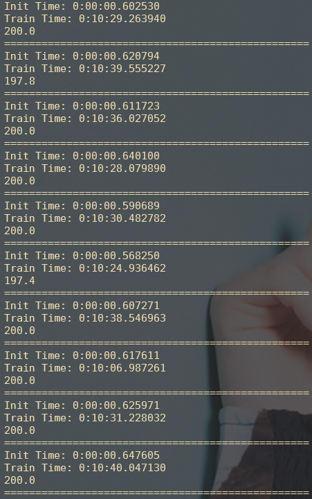
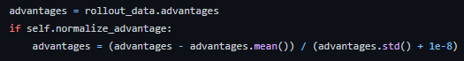
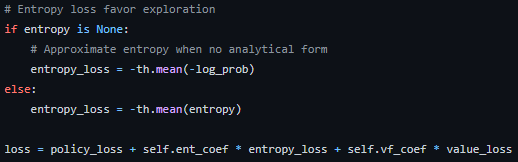
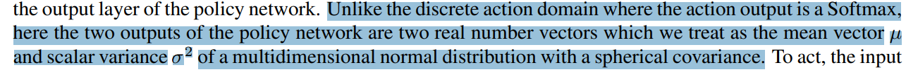
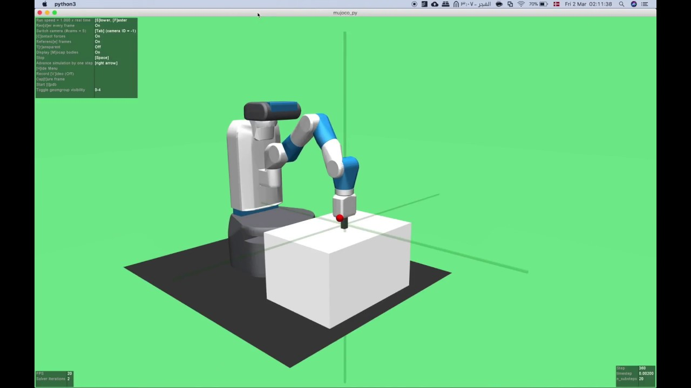
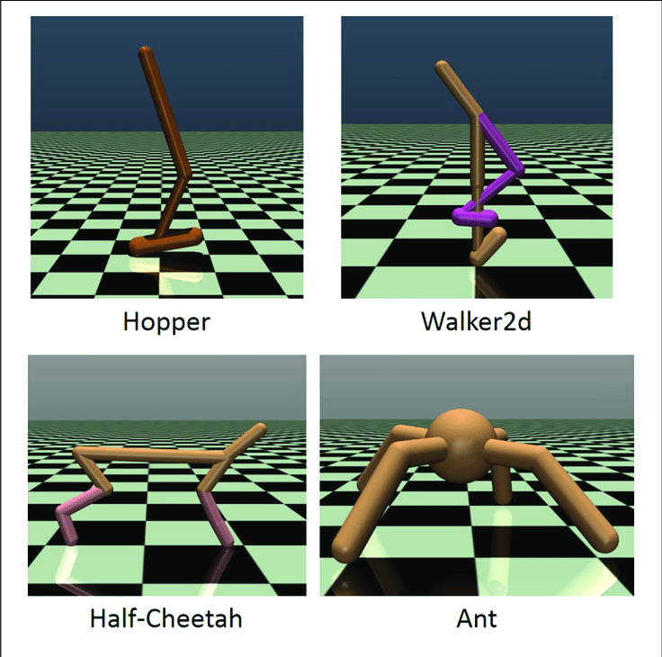
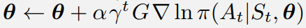

---
# 9월 1주차
##### 정재현
##### 이아영 (모든 이미지 작업)
---

# 1. stable-baselines3와 작성자 모듈의 A2C 알고리즘 속도비교

## 1.1. 비교 환경과 코드

- 서버 cpu를 사용한다. (gpu 비교도 고려했으나 서버에서 허용이 안됨)
- 100만 번의 스텝을 학습한다. (저번과 같은 10번으로는 부족하다고 판단)
- 하이퍼 파라미터를 동일하게 설정
- 뉴럴넷의 모양을 동일하게 설정
- Adam Optimizer를 사용

### 1.1.1. stable-baselines3

```python
from datetime import datetime

# 시작 시간
startTime = datetime.now()

import gym
from stable_baselines3 import A2C

env = gym.make("CartPole-v0")

# 작성자의 모듈과 동일하게 파라미터 설정
model = A2C(
        "MlpPolicy",
        env,
        gae_lambda=1,
        use_rms_prop=False,  # RMSProp 옵티마이저 대신에 Adam을 사용
        learning_rate=1e-4,
        n_steps=10,
        vf_coef=1,
        verbose=0)

# 모듈 초기화에 걸린 시간
print(f"Init Time: {datetime.now() - startTime}")

# 학습이 시작되는 시간
startTrainTime = datetime.now()

model.learn(
        total_timesteps=1000000,  # 백만번의 학습을 시행
        n_eval_episodes=0)

# 학습이 끝나는 시간
print(f"Train Time: {datetime.now() - startTrainTime}")

# 성능 측정을 위한 테스트 코드
returns = [0]*10
for episode in range(10):
    obs = env.reset()
    while True:
        action, state = model.predict(obs)
        obs, reward, done, info = env.step(action)
        returns[episode] += reward
        if done:
            break

print(sum(returns) / 10)
print("=================================================")
```

### 1.1.2. 작성자의 모듈

```python
from datetime import datetime

# 시작 시간
startTime = datetime.now()

# 파이토치
import torch.optim as optim

# 작성자의 모듈
from module.PolicyGradient.models import ANN_V3
from module.PolicyGradient import A2C

# 환경
import gym
env = gym.make('CartPole-v0')
num_actions = env.action_space.n
num_states = env.observation_space.shape[0]

A2C_model = ANN_V3(num_states, num_actions)
optimizer = optim.Adam(A2C_model.parameters(), lr=1e-4)

# 작성자의 모듈 초기화
advantage_AC = A2C(
    env=env,
    model=A2C_model,
    optimizer=optimizer,
    verbose=0,
    policy={
        'train': 'stochastic',
        'test': 'greedy',
    },
)

# 모듈 초기화에 걸린 시간
print(f"Init Time: {datetime.now() - startTime}")

# 학습이 시작되는 시간
startTrainTime = datetime.now()

advantage_AC.train(
        trainTimesteps=1000000,
        testSize=0)

# 학습이 끝나는 시간
print(f"Train Time: {datetime.now() - startTrainTime}")

# 성능 측정을 위한 테스트
print(advantage_AC.test(testSize=10))
print("=================================================")
```

## 1.2. CartPole-v0 환경에서의 비교

아래와 같은 순서대로 출력된다.
- Init Time: 모듈 초기화에 걸린 시간
- Train Time: 학습에 걸린 시간
- Reward: 보상합 (200이 최대)

### 1.2.1. stable-baselines3

<br/>

**모듈 초기화에 걸린 시간의 평균: 1.54초**<br/>
**학습에 걸린 시간의 평균: 15분 39.55초**<br/>

### 1.2.2. 작성자의 모듈

<br/>

**모듈 초기화에 걸린 시간의 평균: 0.61초**<br/>
**학습에 걸린 시간의 평균: 10분 30.52초**<br/>

## 1.3. 결론

100만번의 timestep을 진행했을 때, 모듈 초기화는 대략 0.93초, 학습은 3분 50.97초 정도 빨랐다.

**즉, 작성자의 모듈이 3분 51.90초 정도 빨랐다.**

하지만, stable-baselines3가 지원하는 기능 중에, 작성자의 모듈이 지원하지 않는 기능이 많다. 따라서 이는 완벽한 비교라고 할 수는 없을것이다.

## 1.4. 작성자 모듈의 개선점

**stable-baselines3의 소스코드를 확인했다. 그리고 다음과 같은 차이점을 발견했다.**

### 1.4.1. Advantage Normalization

**Advantage Normalization을 사용할 수 있는 코드가 존재했다.**<br/>
<br/>
<https://github.com/DLR-RM/stable-baselines3/blob/master/stable_baselines3/a2c/a2c.py>

간단한 계산이기 때문에 바로 구현 가능한다.

### 1.4.2. Entropy Loss Term

**학습 안정화를 위한 Entropy Loss를 사용한다.**<br/>
<br/>
<https://github.com/DLR-RM/stable-baselines3/blob/master/stable_baselines3/a2c/a2c.py>

Entropy Loss Term을 사용하는 방법은 여러가지 있다. 작성자의 지식 부족으로 아직 구현할 수 없다.

### 1.4.3. Gradient Clipping

**stable-baselines3는 Gradient Explosion 문제를 해결하기 위한 Gradient Clipping을 지원한다.**

stable-baselines3에서는 상수 값을 사용하는 Gradient Clippint, 그리고 Value Clipping, Norm Clipping을 지원한다.

**작성자의 모듈도 사용할 수 있도록 코드 수정을 고려하고 있다.**

# 2. 복수 행동 테스트가 가능한 환경 찾기

## 2.1. 복수개 행동을 위한 힌트 발견

<br/>
*Volodymyr Mnih, Adria Puigdomenech Badia, Mehdi Mirza, Alex Graves, Timothy Lillicrap, Tim Harley, David Silver, and Koray Kavukcuoglu. Asynchronous methods for deep reinforcement learning. In International Conference on Machine Learning, pages 1928–1937, 2016.*

A3C 논문에서는 MuJoCo Physics Simulator문제를 위와 같은 방법으로 해결했다.<br/>
**즉, 뉴럴넷이 2개의 값(평균, 표준편차)을 행동 개수만큼 출력하도록 만들었다.**<br/><br/>

> 예를 들어, 거미를 앞으로 나아가게 하는 목표를 가지고 있고, 움직일 수 있는 관절의 수를 8개라고 가정하자.<br/>
> 그러면, A3C(A2C도 동일) 뉴럴넷은 16개의 출력값을 가진다. (평균 8개, 표준편차 8개) 

## 2.2. MuJoCo 환경을 사용하기로 결정

**많은 연구에서 사용하고 있는 MuJoCo를 테스트 하기로 결정했다.**<br/>
<br/>
<https://mujoco.org/>

**MuJoCo는 다음 사진과 같은 여러 환경을 제공한다.**<br/>
**그리고 각 관절 또는 모터에 실수 값을 받게 되면 각 로봇을 움직일 수 있도록 환경이 만들어져 있다.**<br/>
<br/>
<br/>

# 3. Policy Gradient 방법론의 문제점 발견

**Policy Gradient는 로그 함수는 음수를 처리하지 못한다!**<br/>
기본적인 Policy Gradient의 업데이트 방법는 다음과 같다.<br/>
<br/>
*Richard Sutton and Andrew Barto. Reinforcement Learning: An Introduction. MIT Press, 2018. page 350*

**위의 식에서 ln이 로그 함수를 의미하는데, 파이 즉, 뉴럴넷이 초반에는 음수를 출력한다. 따라서 로그 함수 안에 음수가 들어가는 경우가 존제한다.**

## 3.1. 문제 해결을 위해 확률로 변경

**위의 문제를 해결하기 위해 Action Value를 직접 넣는 방법 대신에 softmax 함수를 사용하여 확률값으로 넣어줬다. 하지만 학습이 안정적이지 못하다.**

## 3.2. 문제 해결을 위해 relu 활성 함수 사용

테스트로 tanh 함수를 활성 함수로 사용했으나, tanh는 -파이/2 부터 +파이/2 사이 값을 출력하므로 뉴럴넷 출력 레이어가 음수가 될 가능성이 있다. 따라서 음수값이 나오지 않는 relu를 사용해 보았다.<br/>
**하지만, 결과는 만족스럽지 못했다.**

# 4. 다음주 계획

## 4.1. MuJoCo 학습 환경 테스트를 위한 연구

사실 뉴럴넷 마지막 단에 행동의 수 곱하기 2 만큼의 출력을 하도록 만들면 바로 실험이 가능하다. **하지만 논문에서 사용한 방법을 정확히 확인하고 사용하고자 한다.**

## 4.2. Policy Graident 문제 해결을 위한 방법 시도

**위에서 제시한 대로 여러 방법을 시도해 보고 적절한 방법을 선택하고자 한다.**

## 4.3. Gradient Clipping 지원

Gradient Clipping은 Gradient Explosion을 막기위한 좋은 방법이다. 특히 강화학습에서는 학습의 안정이 중요한데, stable-baselines3를 보고서 꼭 필요한 기능이라고 생각했다.<br/>
**따라서 Gradient Clipping을 모듈에서 지원하도록 만들고자 한다.**
