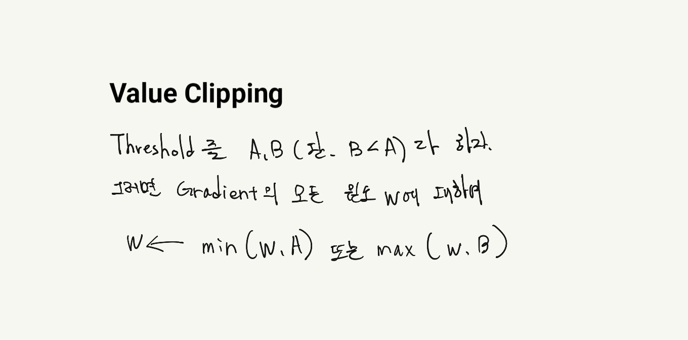
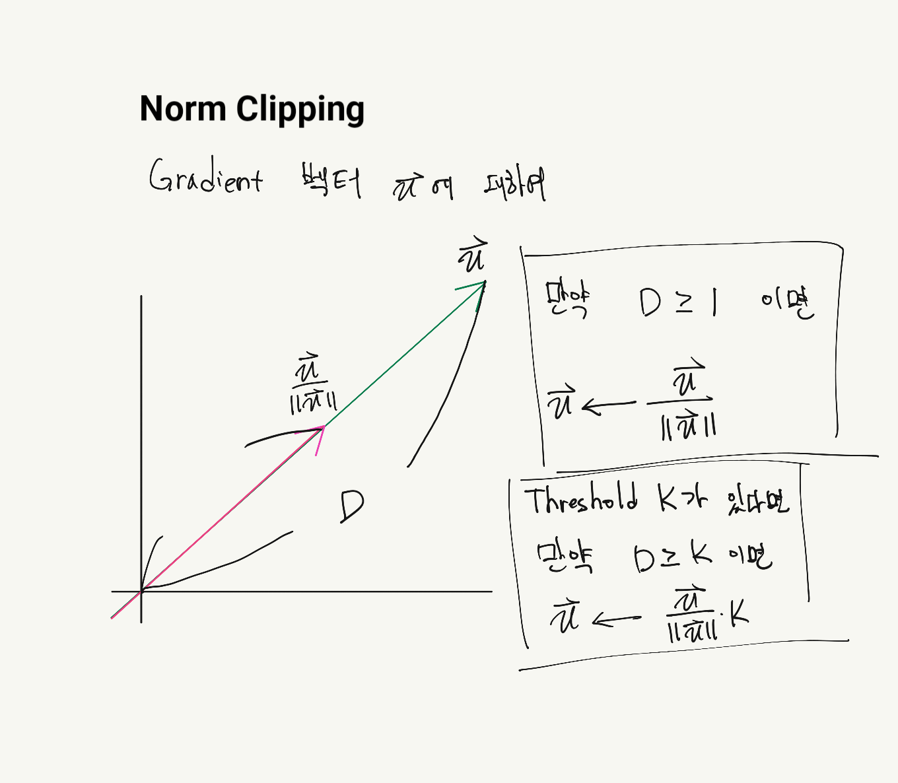
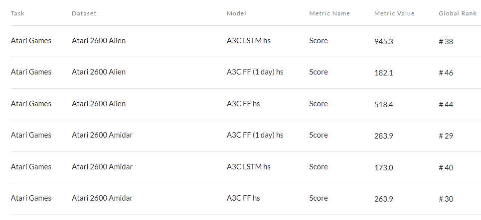
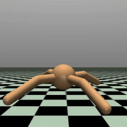
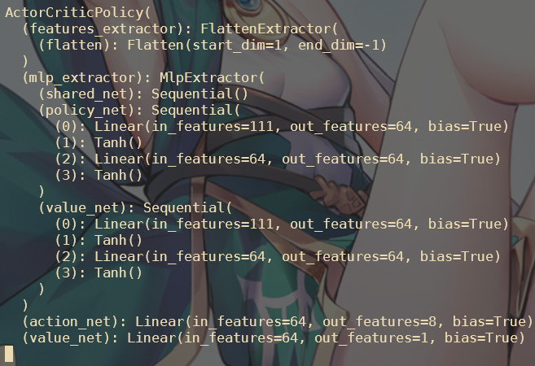

---
# 9월 2주차
##### 정재현
##### 이아영 (모든 이미지 작업)
---

# 1. Policy Gradient 문제 해결

## 1.1. relu를 사용한 시도의 문제점

relu는 0 이상의 실수를 출력하는 활성함수이다. 따라서 로그 함수에 음수가 들어가는 것을 막는다. 하지만 강화학습에서는 leaky ReLU, sigmoid, tanh, GELU등 여러 함수가 사용될 수 있다. 따라서 좋은 방법이 아니라고 판단했다.

## 1.2. 확률값을 출력하도록 변경

**softmax 함수를 사용하여 출력하기로 결정하고 하이퍼 파라미터만 잘 맞춘다면 문제없이 작동함을 확인했다.**<br/>
<br/>
*CartPole-v0에서 테스트*

# 2. Gradient Clipping을 적용

## 2.1. Value Clipping

<br/>

## 2.2. Norm Clipping

<br/>

## 2.3. 작성한 코드

**Backpropagation 과정을 위한 메소드를 만들고 Gradient Clipping 요소를 추가했다.**<br/>
**다음은 RL.py에 있는 step 메소드이다.**<br/>
```python
    # Update Gradient
    def step(self, loss):

        # Calculate Gradient
        self.optimizer.zero_grad()
        loss.backward()

        # Gradient Clipping
        torch.nn.utils.clip_grad_norm_(
                self.model.parameters(),
                max_norm=self.clippingParams['maxNorm'],
                norm_type=self.clippingParams['pNormValue'],
                )

        # Backpropagation and count steps
        self.optimizer.step()
        self.steps_done += 1
```

# 3. A2C는 이미지를 Feed Forward, LSTM으로 해결할 때 좋은 성능을 보인다.

난 자동차 문제를 이미지로 해결하기 위한 많은 방법을 계속 시도하고 있다.<br/>
자동차 주변의 이미지를 n스택 데이터로 바꾸고, (n, width, height)와 같은 모양의 텐서를 CNN에 넣고, DQN을 시도하고 있다.<br/>
하지만 성능의 향상은 있어도 학습이 안정되지 않는다.<br/>
**따라서 A2C와 CNN을 사용하려고 알아보던 도중 다음과 같은 사실을 알았다.**<br/>
<br/>
*Atari 2600 Alien은 이미지를 입력으로 받고 행동을 취한다.*<br/><br/>

**A2C는 이미지를 처리하는데 LSTM과 FF(Feed Forward) 모델이 더 좋은 성능을 보인다!**<br/>
**따라서 flatten 함수를 사용하여 이미지를 1차원 데이터로 변형하여 테스트 하고있다.**<br/>

# 4. MuJoCo Ant-v2 환경에서 테스트

<br/>
*OpenAI MuJoCo Ant-v2*<br/>

## 4.1. 행동

다리의 모든 관절을 움직일 수 있다. **즉, -1 부터 1 사이의 8개 실수값을 행동으로 받는다.**<br/>

## 4.2. 저번 자료에서 제시한 Continuous Control 문제 해결 방법

- 뉴럴넷은 두개의 실수값, 평균과 표준편차를 출력한다.<br/>
- 출력된 값으로 정규분포를 만든다.<br/>
- 정규분포를 기반으로 실수값을 선택한다.<br/><br/>

**즉, 8개의 관절을 움직이기 위해서는 16개의 값이 필요하다. 하지만 stable-baselines3가 사용하는 방법은 달랐다.**

## 4.3. stable-baselines3에서 제시한 Continuous Control 문제 해결 방법

<br/>
*실제로 확인한 모델의 모양*<br/>

- 뉴럴넷은 8개의 실수값을 출력한다.<br/><br/>
 
**따라서, Ant-v2가 필요로 하는 사이의 8개의 실수가 완성된다.**<br/>

# 5. 다음주 계획

# 5.1. A2C를 사용하여 MuJoCo Ant-v2 환경 학습

**지금까지 Continuous Control을 위한 Policy 설정 방식을 알아보았다. 따라서 하나의 방법을 선택하고 구현해보고자 한다.**

# 5.2. 작성자의 모델과 stable-baselines3의 속도 비교

**이미 stable-baselines3에서 잘 작동함은 확인했다. 따라서 비교는 간단할 것이라 예상된다.**

# 5.3. 여러 Exploring 지원

작성자의 모듈은 지금 epsilon-greedy와 stochastic(확률 기반의 행동 선택)을 사용하여 Exploring을 보장하고 있다. **하지만 noise, State-dependent Exploring, Generalized State-dependent Exploring, Likelihood Ratio 등 여러가지 Exploring 방법이 있다. 따라서, 각 Exploring 알고리즘을 구현하고자 한다.**
