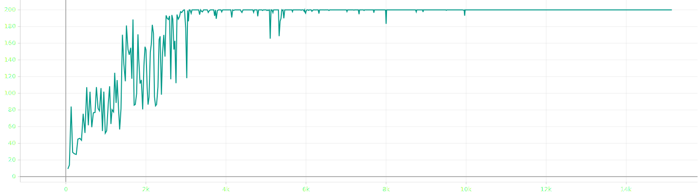

---
# 9월 2주차
##### 정재현
##### 이아영 (모든 이미지 작업)
---

# 1. Policy Gradient 문제 해결

## 1.1. relu를 사용한 시도의 문제점

relu는 0 이상의 실수를 출력하는 활성함수이다. 따라서 로그 함수에 음수가 들어가는 것을 막는다. 하지만 강화학습에서는 leaky ReLU, sigmoid, tanh, GELU등 여러 함수가 사용될 수 있다. 따라서 좋은 방법이 아니라고 판단했다.

## 1.2. 확률값을 출력하도록 변경

**softmax 함수를 사용하여 출력하기로 결정하고 하이퍼 파라미터만 잘 맞춘다면 문제없이 작동함을 확인했다.** 
 
*CartPole-v0에서 테스트*
