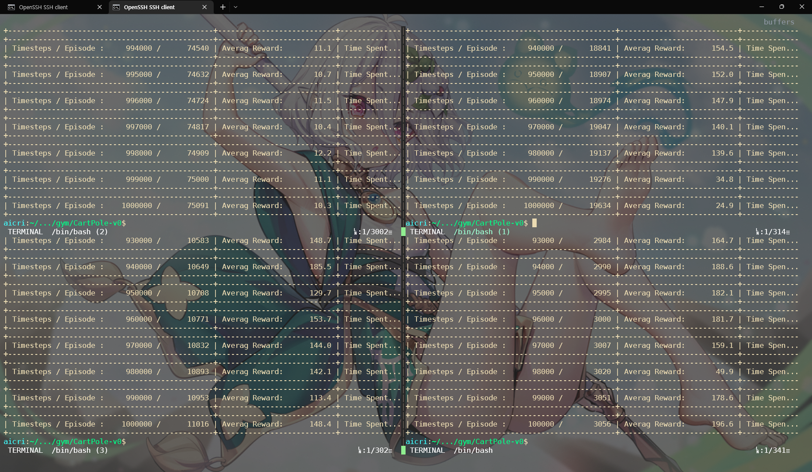
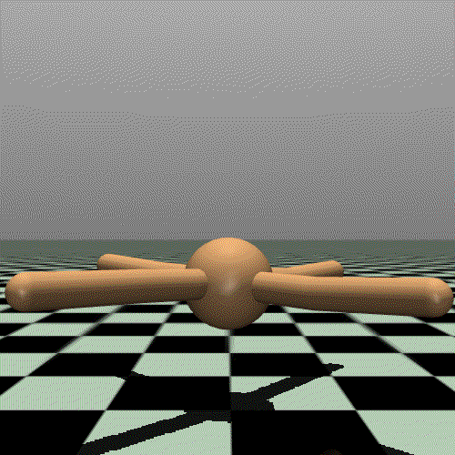
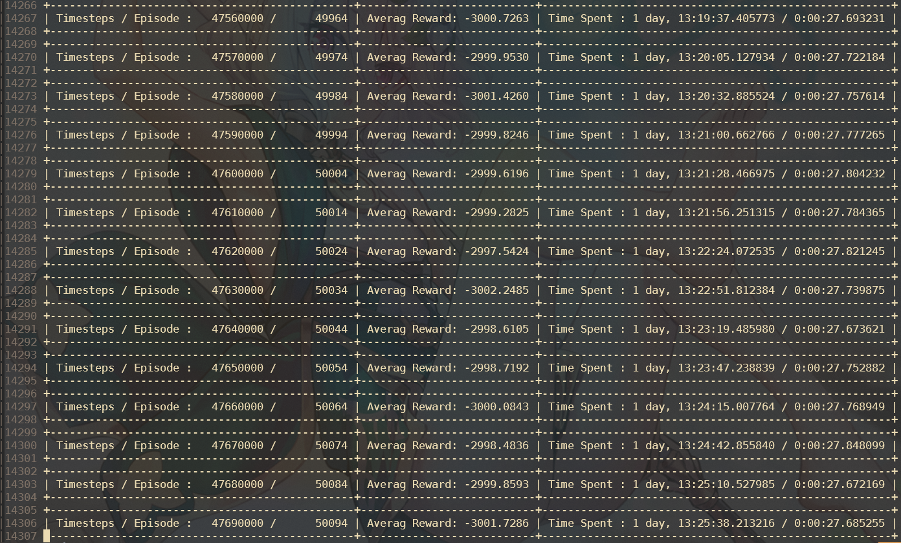

---
# 9월 4주차
##### 정재현
##### 이아영 (모든 이미지 작업)
---

# 9월 15일

## 1. Policy Gradient의 ActionValue와 StateValue를 계산하는 class 작성

```python
from typing import Union, Dict

import numpy as np

# PyTorch
import torch

# module
from module.Policy import DiscretePolicy, ContinuousPolicy
from module.utils.ActionSpace import ActionSpace


class Value():

    def __init__(
        self,
        model: torch.nn.Module,
        optimizer,
        actionSpace: ActionSpace,
        actionParams: Dict[str, Union[int, float, Dict]] = {

            # for DISCRETE

            'algorithm': "greedy",  # greedy, stochastic
            'exploring': "epsilon",  # epsilon, None
            'exploringParams': {
                'start': 0.99,
                'end': 0.0001,
                'decay': 10000
            }
        },
        clippingParams: Dict[str, Union[int, float]] = {
            'pNormValue': 2,
            'maxNorm': 1,
        },
    ):

        # Initialize Parameter
        self.actionSpace = actionSpace
        self.stepsDone = 0

        # Set policy
        if self.actionSpace.actionType == 'Discrete':
            self.policy = DiscretePolicy(**actionParams)
        elif self.actionSpace.actionType == 'Continuous':
            self.policy = ContinuousPolicy(**actionParams)
        else:
            raise ValueError(
                "actionType only for Discrete and Continuous Action")

    # Update Weights
    def step(self, loss):

        # Calculate Gradient
        self.optimizer.zero_grad()
        loss.backward()

        # Gradient Clipping
        torch.nn.utils.clip_grad_norm_(
                self.model.parameters(),
                max_norm=self.clippingParams['maxNorm'],
                norm_type=self.clippingParams['pNormValue'],
                )

        # Backpropagation and count steps
        self.optimizer.step()
        self.stepsDone += 1

    # Returns a value of the state
    # (state value function in Reinforcement learning)
    def StateValue(
            self,
            s: torch.Tensor,
            ) -> torch.Tensor:

        value, _ = self.model.forward(s)

        return value

    # Get Action Value from state
    def ActionValue(
            self,
            s: Union[torch.Tensor, np.ndarray],
            ) -> torch.Tensor:

        s = torch.Tensor(s).to(self.device).unsqueeze(0)
        _, ActionValue = self.model.forward(s)
        ActionValue = ActionValue.squeeze(0)

        return ActionValue

    # In Reinforcement learning,
    # pi means the function from state space to action probability distribution
    # Returns probability of taken action a from state s
    def pi(
            self,
            s: torch.Tensor,
            a: torch.Tensor) -> torch.Tensor:

        a = a.unsqueeze(dim=-1)

        _, probs = self.model.forward(s)
        actionValue = torch.gather(torch.clone(probs), 1, a).squeeze(dim=1)

        return actionValue

    # Get Action from State s
    @torch.no_grad()
    def get_action(
            self,
            s: Union[torch.Tensor, np.ndarray],
            ) -> torch.Tensor:

        ActionValue = self.value(s)

        return self.policy(
                ActionValue,
                self.stepsDone
                )
```

## 1. Gym의 ActionSpace인 Box와 Discrete를 모듈 내부의 ActionSpace로 변환하는 함수 작성

```python
from gym.spaces import Box, Discrete
import numpy as np

from module.utils.ActionSpace import ActionSpace


def fromDiscrete(
        space: Discrete
        ):

    # Biggiest index of action is space.n - 1
    # Because space.n is a size of action space
    high = np.array([space.n-1], dtype=space.dtype)
    low = np.array([0], dtype=space.dtype)

    return ActionSpace(high, low)


def fromBox(
        space: Box
        ):

    high = space.high
    low = space.low

    return ActionSpace(high, low)
```

# 9월 16일

## 1. ./module/utils/ActionSpace/ActionSpace.py __init__.py 수정

```python
        # If it has its own actionSpace
        if (high is None and low is None) and actionSpace is not None:

            if type(actionSpace) == Discrete:
                self.__dict__ = fromDiscrete(actionSpace).__dict__
            if type(actionSpace) == Box:
                self.__dict__ = fromBox(actionSpace).__dict__

            if not (type(actionSpace) in [Discrete, Box]):
                raise ValueError(
                    f"Supported Action Spaces are {str(Discrete)}, {str(Box)}")

        # When high and low given
        elif (high is not None and low is not None) and actionSpace is None:

            self.dtype = high.dtype  # Data type of each element
            self.high = high  # Biggest values of each element
            self.low = low  # Smallest values of each element
            self.shape = high.shape  # Shape of Actions

            # Check Validity
            # int or float
            if self.dtype in [np.int32, np.int64]:
                self.actionType = 'Discrete'
            elif self.dtype in [np.float32, np.float64]:
                self.actionType = 'Continuous'
            else:
                raise ValueError(
                        "Action Space data type should be float or integer")

            # Check data type and shape
            if self.high.dtype != self.low.dtype:
                raise ValueError(
                        "high and low have different data type!")
            if self.high.shape != self.low.shape:
                raise ValueError(
                        "high and low have different shape!")

        else:
            raise ValueError(
                    "")
```

1. high와 low를 받으면 맞춰서 ActionSpace를 생성한다.<br/>
2. 외부의 Action Space를 사용하고 싶으면 actionSpace 파라미터를 사용할 수 있다. (우선 gym의 Box와 Discrete를 지원)<br/>

## 2. ./module/Policy/Policy.py의 ContinuousPolicy class를 작성

```python
class ContinuousPolicy(Policy):

    def __init__(
            self,
            algorithm: str = "plain",  # plain
            exploring: str = "normal",  # normal, None
            exploringParams: Dict[str, Union[int, float]] = {
                'mean': 0,  # mean
                'sigma': 1,  # standard deviation
            },):

        super().__init__(
                algorithm=algorithm,
                exploring=exploring,
                exploringParams=exploringParams,
                )

        # Initialize Parameters
        if exploring == 'normal':
            self.useEps = True
            self.exploration = NormalNoise(
                    **exploringParams)

    # Return Action
    @overrides(Policy)
    def __call__(
            self,
            actionValue: torch.Tensor,
            stepsDone: int,
            ) -> torch.Tensor:

        # Get noise
        noise = self.exploration(
                stepsDone,
                actionValue.shape)

        # Add noise to action
        action = actionValue + noise

        return action
```

## 3. 모양에 맞는 noise 생성을 위한 ./module/utils/exploration.py의 NormalNoise class 수정

```python
class NormalNoise():

    def __init__(
            self,
            mean: float,
            sigma: float):

        self._mu = mean
        self._sigma = sigma

    def __call__(
            self,
            stepsDone: int,
            shape: Union[tuple, int],
            ) -> float:

        return np.random.normal(self._mu, self._sigma, shape)
```

## 4.  Value Function의 역할을 하는 ./module/PG/Value/Value.py 의 Value class 초기화 수정

```python
    def __init__(
        self,
        model: torch.nn.Module,
        optimizer,
        actionSpace: ActionSpace,
        actionParams: Dict[str, Union[int, float, Dict]] = None,
        clippingParams: Dict[str, Union[int, float]] = {
            'pNormValue': 2,
            'maxNorm': 1,
        },
    ):

        # Initialize Parameter
        self.model = model
        self.optimizer = optimizer
        self.clippintParams = clippingParams
        self.actionSpace = actionSpace
        self.stepsDone = 0

        # Set policy
        if self.actionSpace.actionType == 'Discrete':

            # default actionParams
            if actionParams is None:
                actionParams = {
                    'algorithm': "greedy",  # greedy, stochastic
                    'exploring': "epsilon",  # epsilon, None
                    'exploringParams': {
                        'start': 0.99,
                        'end': 0.0001,
                        'decay': 10000
                    }
                }

            self.policy = DiscretePolicy(**actionParams)

        if self.actionSpace.actionType == 'Continuous':

            # default actionParams
            if actionParams is None:
                actionParams = {
                    'algorithm': "plain",  # greedy
                    'exploring': "normal",  # normal
                    'exploringParams': {
                        'mean': 0,
                        'sigma': 1,
                    }
                }

            self.policy = ContinuousPolicy(**actionParams)

        if self.actionSpace.actionType \
                not in ['Discrete', 'Continuous']:

            raise ValueError(
                "actionType only for Discrete and Continuous Action")
```

1. model, optimizer, clippingParams등의 property를 초기화<br/>
2. actionParams을 설정하지 않은 경우 default를 사용하도록 작성<br/><br/>

**이 Value class는 Value Function의 역할을 제외하고도 다음과 같은 역할을 한다.**<br/>
1. Policy property를 가지고 행동을 출력한다.<br/>
2. Value Function의 역할을 하는 뉴럴넷을 property로 가지고 관리한다.<br/>

# 9월 19일

## 1. 버그 고치기 

### 1.1. ./module/PG/Value/Value.py에서, 모든 행동의 Value를 출력하는 메소드와 특정 행동의 Value를 출력하는 메소드 분리

```python
    # Get all Action Value as Tensor from state
    def ActionValue(
            self,
            s: Union[torch.Tensor, np.ndarray],
            ) -> torch.Tensor:

        s = torch.Tensor(s).to(self.device).unsqueeze(0)
        _, ActionValue = self.model.forward(s)
        ActionValue = ActionValue.squeeze(0)

        return ActionValue

    # In Reinforcement learning,
    # pi means the function from state space to action probability distribution
    # Returns probability of taken action a from state s
    def pi(
            self,
            s: torch.Tensor,
            a: torch.Tensor) -> torch.Tensor:

        a = a.unsqueeze(dim=-1)

        _, probs = self.model.forward(s)
        actionValue = torch.gather(torch.clone(probs), 1, a).squeeze(dim=1)

        return actionValue
```

### 1.2. test 메소드를 ./module/RL.py에서 ./module/PG/PolicyGradient.py, ./module/VB/ValueBased.py로 이동

**Policy Gradient 알고리즘과 Value Based 알고리즘은 서로 다른 self.value를 가진다.(실제로 디렉토리 구조를 보면 ./module/PG/Value, ./module/VB/Value 2개가 존재한다.) 따라서 self.value를 사용하는 test의 디렉토리를 바꿀 필요가 있다고 판단했다. (Value 폴더와 같거나 더 아래의 폴더로)**<br/><br/>

```python
    # Test to measure performance
    @overrides(RL)
    def test(
            self,
            testSize: int) -> Union[float, str]:

        rewards = []

        for _ in range(testSize):

            state = self.testEnv.reset()
            done = False
            cumulativeRewards = 0

            for timesteps in range(self.maxTimesteps):
                if self.isRender['test']:
                    self.testEnv.render()

                action = self.value.get_action(state)

                next_state, reward, done, _ = self.testEnv.step(action)

                cumulativeRewards += reward
                state = next_state

                if done or timesteps == self.maxTimesteps-1:
                    break

            rewards.append(cumulativeRewards)

        if testSize > 0:
            return sum(rewards) / testSize  # Averaged Rewards
        elif testSize == 0:
            return "no Test"
        else:
            raise ValueError("testSize can't be smaller than 0")
```

### 1.3. 이 외에도 자잘한 버그를 수정했다. 이는 따로 기재하지 않겠다.

# 9월 20일

## 1. Value Based 방법론 버그 수정 DQN, ADQN

### 1.1. DQN과 ADQN은 서로 다른 Value 측정 방법을 가진다.

* DQN은 현재 있는 모델을 기반으로 Value를 측정한다.<br/>
* ADQN은 과거 k개의 모델을 기반으로 Value를 측정하고, 이를 k로 나눠 평균 Value를 측정한다.<br/><br/>

**따라서 A2C, REINFORCE 알고리즘과 같은 방법으로 코드 작성이 불가능하다. 왜냐하면 A2C와 REINFORCE는 마더클래스인 PolicyGradient에서 Value를 정의하기 때문이다.**<br/>
**따라서 다음과 같은 코드로 이를 해결했다.**<br/><br/>

```python
        # Init Value Function, Policy
        # Set ActionSpace
        if env:
            actionSpace = ActionSpace(
                    actionSpace=env.action_space)
        else:
            if trainEnv.action_space \
                    != testEnv.action_space:
                raise ValueError(
                        "Action Spaces of trainEnv and testEnv don't match")
            actionSpace = ActionSpace(
                    actionSpace=trainEnv.action_space)

        value = Value(
                model=model,
                device=device,
                optimizer=optimizer,
                actionSpace=actionSpace,
                actionParams=actionParams,
                clippingParams=clippingParams,
                )

        # init parameters
        super().__init__(
            trainEnv=trainEnv,
            testEnv=testEnv,
            env=env,
            device=device,
            value=value,
            maxTimesteps=maxTimesteps,
            maxMemory=maxMemory,
            discount=discount,
            numBatch=numBatch,
            isRender=isRender,
            useTensorboard=useTensorboard,
            tensorboardParams=tensorboardParams,
            verbose=verbose,
            gradientStepPer=gradientStepPer,
            epoch=epoch,
            trainStarts=trainStarts,
        )
```

**value를 DQN, ADQN 클래스에서 정의 후, 이를 파라미터로 ValueBased 클래스에 넘겨준다. 그리고 ValueBased 클래스에서 self.value = value와 같이 프로퍼티를 정의한다.**

## 2. 나머지 사항은 PolicyGradient와 비슷하게 수정

## 3. DQN과 ADQN은 다른 Value를 가지기 때문에 Value를 마더클래스로 가지는 AveragedValue class 작성

```python
class AveragedValue(Value):

    def __init__(
        self,
        model: torch.nn.Module,
        device: torch.device,
        optimizer,
        actionSpace: ActionSpace,
        actionParams: Dict[str, Union[int, float, Dict]] = None,
        clippingParams: Dict[str, Union[int, float]] = {
            'pNormValue': 2,
            'maxNorm': 1,
        },
        numPrevModels: int = 10,
    ):

        super().__init__(
                model=model,
                device=device,
                optimizer=optimizer,
                actionSpace=actionSpace,
                actionParams=actionParams,
                clippingParams=clippingParams)

        # save last K previously learned Q-networks
        self.prevModels: deque = deque([], maxlen=numPrevModels)

    # action seleted from previous K models by averaging it
    @overrides(Value)
    def action_value(
            self,
            s: Union[torch.Tensor, np.ndarray]) -> torch.Tensor:

        s = torch.Tensor(s).to(self.device)

        values = self.model.forward(s)
        # last model is equal to self.model
        for model in list(self.prevModels)[:-1]:
            values += model.forward(s)

        values = values / len(self.prevModels)

        return values
```

* prevModels 프로퍼티는 과거의 모델을 저장한다.
* action_value 메소드가 평균값을 출력하게 만들어 나머지 메소드가 편균값 기반으로 작동하도록 코드를 작성했다.

## 4. 테스트

**CartPole-v0 환경을 사용하고, A2C(왼쪽 위), REINFORCE(왼쪽 아래), DQN(오른쪽 위), ADQN(오른쪽 아래) 알고리즘 테스트를 진행했다.**<br/>

<br/>
*Variance가 클 수는 있지만, A2C는 아무리 봐도 이상하다. 따라서 수정할 예정이다.*

# 9월 21일

## 1. Continuous Control을 위해 ./module/PG/Value/Value.py, ./module/VB/Value/Value.py의 pi 메소드를 ./module/Policy/Policy.py의 DiscretePolicy, ContinuousPolicy로 이동

```python
    @overrides(Policy)
    def pi(
            self,
            actionValue: torch.Tensor,
            s: torch.Tensor,
            a: torch.Tensor) -> torch.Tensor:

        actionValue = torch.gather(
                torch.clone(actionValue), 1, a).squeeze(dim=1)

        return actionValue
```
*DiscretePolicy 클래스의 pi 메소드*<br/><br/>

```python
    @overrides(Policy)
    def pi(
            self,
            actionValue: torch.Tensor,
            s: torch.Tensor,
            a: torch.Tensor) -> torch.Tensor:

        a = a.squeeze(dim=-1)
        dist = Normal(actionValue, torch.ones(actionValue.shape))

        return dist.log_prob(a)
```
*ContinuousPolicy 클래스의 pi 메소드 (아직 오류가 있다)*<br/><br/>

## 2. MuJoCo 환경에서 테스트하기 위한 코드 작성

**Ant-v2 환경에서 테스트 하기 위해, ./TRIALS/mujoco/Ant-v2/ 디렉토리를 만들었다. 다음은 Ant-v2 환경의 사진이다.**<br/>
<br/><br/>

```python
import sys
sys.path.append("../../../") # to import module

# 파이토치
import torch.optim as optim

# 작성자의 모듈
from module.PG.models import ANN_V2
from module.PG import A2C

# 환경
import gym
env = gym.make('Ant-v2')
num_actions = env.action_space.shape[0]
num_states = env.observation_space.shape[0]

A2C_model = ANN_V2(num_states, num_actions)
optimizer = optim.Adam(A2C_model.parameters(), lr=1e-4)

# 작성자의 모듈 초기화
advantage_AC = A2C(
    env=env,
    model=A2C_model,
    optimizer=optimizer,
    verbose=1,
    useTensorboard=True,
    tensorboardParams={
        'logdir': "../../runs/A2C_Ant_v2",
        'tag': "Averaged Returns/ANN_V3_lr=1e-4"
    },
    nSteps=50,
)

advantage_AC.train(trainTimesteps=1000000, testPer=10000)
```
*./TRIALS/mujoco/A2C.py*

# 9월 22일

## 1. A2C, REINFORCE 알고리즘 코드 수정

우연히 찾고있던 오류를 찾아서 수정했다.<br/>

```python
        # Compute n-step return
        stateValue = self.value.state_value(S_tt[-1].unsqueeze(0))
        values = [stateValue.squeeze(0) * notDone[-1]]
        for r_tt in reversed(R_tt[:-1]):
            values.append(r_tt + self.discount * values[-1])
        values.reverse()

        values = torch.cat(values, 0)
```
*./module/PG/A2C.py의 139~146라인*<br/><br/>

아래는 가중치를 업데이트 하는 과정에서 사용되는 코드이다.
그리고 문제점이 values의 차원에 있다는 사실을 알았다. values는 여러개의 상태를 받아 한번에 state value를 계산한다. **그러면 상태가 n개일 때, n by 1 행렬이 나와야 하는데, n by n 행렬이 출력됐다.** 따라서 위와 같은 코드로 수정해 오류를 해결 했다. 

## 2. MuJoCo test

다음과 같은 코드로 테스트를 진행했다.<br/>
```python
import sys
sys.path.append("../../../") # to import module

# 파이토치
import torch.optim as optim

# 작성자의 모듈
from module.PG.models import ANN_V2
from module.PG import A2C

# 환경
import gym
env = gym.make('Ant-v2')
num_actions = env.action_space.shape[0]
num_states = env.observation_space.shape[0]

A2C_model = ANN_V2(num_states, num_actions)
optimizer = optim.Adam(A2C_model.parameters(), lr=1e-4)

# 작성자의 모듈 초기화
advantage_AC = A2C(
    env=env,
    model=A2C_model,
    optimizer=optimizer,
    verbose=1,
    useTensorboard=True,
    tensorboardParams={
        'logdir': "../../runs/A2C_Ant_v2",
        'tag': "Averaged Returns/ANN_V3_lr=1e-4"
    },
    nSteps=50,
)

advantage_AC.train(trainTimesteps=1000000, testPer=10000)
```

하지만 학습이 안된다.

# 9월 23일

## 1. 자료 조사

**MuJoCo환경에서의 학습을 성공하기 위해, 계속해서 밴치마킹중인 stable-baselines3의 소스코드를 참고했다.**<br/>
```python
    def log_prob(self, actions: th.Tensor) -> th.Tensor:
        """
        Get the log probabilities of actions according to the distribution.
        Note that you must first call the ``proba_distribution()`` method.

        :param actions:
        :return:
        """
        log_prob = self.distribution.log_prob(actions)
        return sum_independent_dims(log_prob)
```
```python
def sum_independent_dims(tensor: th.Tensor) -> th.Tensor:
    """
    Continuous actions are usually considered to be independent,
    so we can sum components of the ``log_prob`` or the entropy.

    :param tensor: shape: (n_batch, n_actions) or (n_batch,)
    :return: shape: (n_batch,)
    """
    if len(tensor.shape) > 1:
        tensor = tensor.sum(dim=1)
    else:
        tensor = tensor.sum()
    return tensor
```

연속적인 값(행동)의 확률을 구하기 위해 정규 분포를 사용한다. 하지만 하나의 행동은 복수개의 실수로 이루어진다. 이때 어떻게 정규분포를 사용하는지에 대한 의문을 가지고 있었고, 해결하지 못했다. **따라서 위 코드를 참고했는데, 각각의 실수의 log probability(정규 분포 기반)을 구하고 다 더하는 방식을 사용함을 확인하고 작성자의 모듈에도 추가했다.**<br/>

추가 후, 테스트를 진행했는데 결과가 좋지 않았다.<br/>
<br/>
*하루 이상 학습한 결과*<br/><br/>

**stable-baselines3에서 학습한 경우, 하루가 안되서 보상이 양수를 가졌다는 사실을 감안하면, 코드가 잘못됐음을 알 수 있었다.**

# 9월 26일

## 1. 학습과 테스트의 Policy를 구분

학습과 테스트는 다른 Policy를 가진다. 하지만 깜빡하고 못해서 코드를 작성했다.<br/>
```python
```
```python
```
